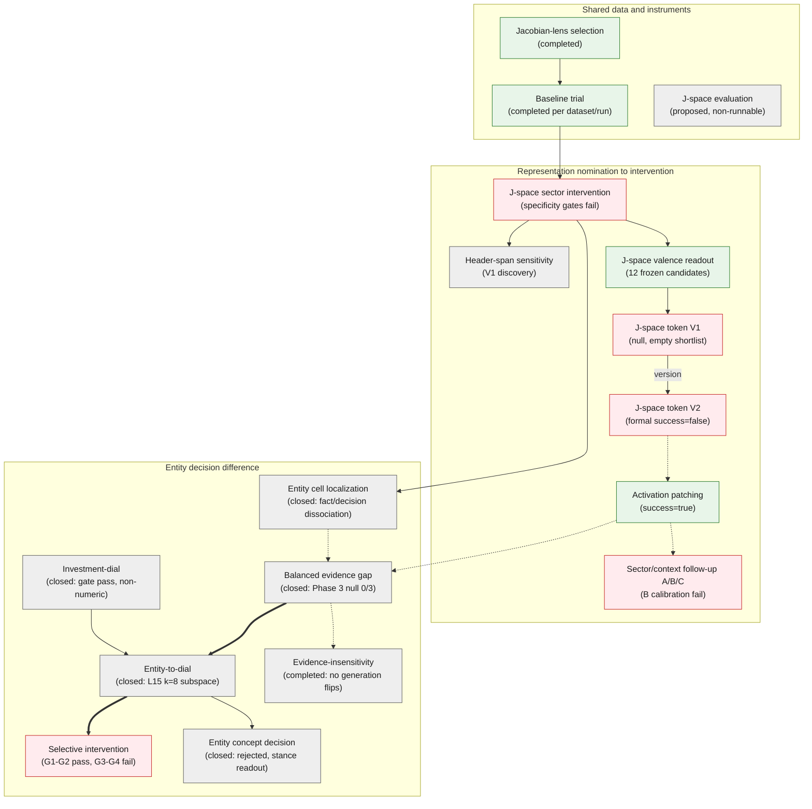

# Entity-level causal representation experiments

This repository studies when an entity-sensitive representation forms inside a
decoder language model and whether replacing a source entity activation with a
target entity activation causally changes the answer distribution.

## Workflows

- `baseline-trial`: run the `data/baseline/` trial-plan prompts through the
  prompt-analysis stages, with a lens-forward per-layer readout stage.
- `prompt-analysis`: per-layer prompt readout, uncertainty, generated-token
  attribution, validation, and result visualization.
- `span-sensitivity`: single-sector behavioral screen over explicit ticker/name
  header spans using fixed Buy/Sell continuation margins.
- `jspace-intervention`: sector-coordinate swap/gain, valence vocabulary readout,
  and matched-random V1 token causal screening over a validated canonical lens.
  The package also implements outcome-conditioned V2 decision-flip testing,
  readout-only prior/direction probes, hierarchical activation patching, and
  sector/context follow-ups. Findings and execution status are listed in the
  [research overview](docs/README.md).
- `jacobian-lens fit`: standalone Jacobian-lens fitting; experiment workflows
  consume fitted lenses and never fit one implicitly.

Archived workflows (`counterfactual-patching`, `prepare-edgar-8k`,
`prepare-counterfactual-data`, `synthetic-entity-bias`,
`prepare-10k-change-data`) live in [`archive/`](archive/README.md); they are
not installed entry points.

`jlens` readouts are transported representations, not direct decoders of hidden
chain-of-thought or discrete reasoning paths.

## Documentation map

- [One-sentence findings, status, and evidence](docs/README.md) — start here;
  follow report links to check evidence, and protocol links when running an experiment.
  Historical details are available for audit, not required sequential reading.
- [Documentation and instruction system](docs/documentation-system.md)
- [Shared experiment core](docs/shared-experiment-core.md)
- [Artifact identity and run manifest contract](docs/artifact-contract.md)
- [Research scripts reference](docs/research-scripts.md)

### Research map

The map below groups the 17 active experiments into the three research
branches used in the [research map table](docs/README.md): shared data and
instruments, representation nomination to intervention, and the entity
decision difference line. Node colors: green gate pass or completed, red
gate fail or null, gray otherwise (line closed, exploratory, or proposed).
Edges mark major upstream relations only: solid data/artifact dependency,
dashed research succession or method reference, and thick solid lines mark
the main convergence axis. The full relationship table with provenance
stays in [docs/README.md](docs/README.md); the frozen exploratory
financial-judgment workflow and other archived lines are not shown (see
[archive/](archive/README.md)). Node names match the experiments linked in
the sections below.



### Research design and planning

- [Research proposals and planning](docs/proposal/README.md)
- [Entity-bias research proposal](docs/proposal/entity-bias-research-proposal.md)
- [Entity-bias roadmap](docs/proposal/entity-bias-roadmap.md)
- [J-space evaluation design](docs/j-space-evaluation/proposal.md) — optional,
  proposed, non-runnable synthetic task-local J-space-candidate preflight for
  comparing compatible local models; not a proposal component or entity-bias
  evidence gate.

### Experiment proposals and reports

The [research overview](docs/README.md) maintains the experiment list, current
findings, report/protocol links, and an expandable relationship table with sources.
This README does not maintain a second copy of per-experiment results.

### Workflow operations

- [Baseline trial proposal](docs/baseline-trial/proposal.md) and [prompt-analysis reproducibility report](docs/baseline-trial/report.md)
- [Technology header-span sensitivity proposal](docs/span-sensitivity/proposal.md) and [report status](docs/span-sensitivity/report.md)
- [Qwen Jacobian-lens selection proposal](docs/jacobian-lens-selection/proposal.md) and [selection report](docs/jacobian-lens-selection/report.md)
- [Interactive prompt-lens dashboard](docs/interactive-prompt-lens-dashboard.md)
- [Archived workflow operations](docs/archive/README.md) — counterfactual patching,
  8-K/10-K dataset preparation, synthetic entity-bias pilot, and easy-bias feasibility

## Setup

Dependencies are managed with `uv`. The root project uses the local
`third_party/jacobian-lens/` and `third_party/jspace-viz/` as editable workspace
members. The external checkouts are intentionally ignored by the root Git
repository.

On a fresh checkout, restore the ignored external worktrees before syncing:

```bash
mkdir -p third_party
git clone https://github.com/anthropics/jacobian-lens.git third_party/jacobian-lens
git clone https://github.com/Festyve/jspace-viz.git third_party/jspace-viz
uv sync
```

The lightweight smoke example uses `unsloth/Llama-3.2-1B-Instruct`; current
Technology J-space experiments use Qwen3.5-4B with its model-specific canonical lens.
Download the smoke model into the ignored `.cache/` directory when needed:

```bash
mkdir -p artifacts .cache/models
uv run hf download unsloth/Llama-3.2-1B-Instruct \
  --local-dir .cache/models/llama-3.2-1b-instruct
```

Qwen3.5-4B uses a model-specific lens because its residual width and layer count
differ from Llama. For checkpoints whose `config.json` proves the exact base
identity `Qwen/Qwen3.5-4B`, install the pinned Neuronpedia artifact explicitly:

```bash
uv run jacobian-lens install \
  --model .cache/models/qwen3.5-4b \
  --base-model Qwen/Qwen3.5-4B
```

The command downloads from a pinned Hugging Face revision, verifies the binary,
source config, model shape, complete layer coverage, and local schema-v2
metadata, then installs an offline canonical artifact. It never downloads at
experiment runtime and does not fuzzy-match instruct or differently shaped
checkpoints. If no exact registry entry exists, use `jacobian-lens fit` or the
controlled local candidate-selection alternative in
[Qwen Jacobian-lens selection](docs/jacobian-lens-selection/proposal.md); do not
replace a canonical lens with a small smoke fit.

## Minimal smoke workflow

```bash
uv lock --check
uv run pytest -q
uv run jacobian-lens fit \
  --model .cache/models/llama-3.2-1b-instruct \
  --calibration-prompts 16
uv run baseline-trial inspect-input \
  --input data/baseline/qwen36-27b-50stocks/trial_plan_prompts.csv
```

For the complete baseline-trial stage sequence, see
[Baseline trial plan prompts](docs/baseline-trial/proposal.md). The
archived counterfactual-patching quickstart remains in
[docs/archive/counterfactual-patching.md](docs/archive/counterfactual-patching.md).

## Data and artifact boundaries

- Models, lens binaries, experiment outputs, and external checkouts remain in
  `.cache/`, `artifacts/`, and `third_party/`; they are not committed to root
  Git.
- Model-scoped lenses live under `artifacts/<model-slug>/jacobian-lens/`.
  Prompt-analysis runs are isolated under
  `artifacts/<model-slug>/<dataset-slug>/runs/<run-id>/`, with `manifest.json`
  and compact `forward/`, `readout/`, and optional `backward/` stage artifacts.
- The manifest records model/dataset identity, input and artifact SHA-256 values,
  record counts, and stage status. Backward attribution must reference the exact
  forward artifact hash and never regenerate its tokens. A run is consumable only
  after all required stages are `complete`.
- Legacy-wide generated-token sampling remains 32 shared dates by default. MAG7
  8-K return-pairs full-generation instead covers every unique pair and writes both
  `original` and `counterfactual` records; it is not the legacy 32 sample.
- No workflow writes complete raw activations to tracked artifacts.
- The archived 8-K counterfactual workflow required manual review and
  promotion before a row was considered validated. See the [dataset
  protocol](docs/archive/counterfactual-dataset-generation.md).
- Jacobian-lens attribution is a local transported-readout or sensitivity
  diagnostic; it is not by itself a causal claim.

## Standard verification

```bash
uv lock --check
uv run pytest -q
uv run python -m compileall -q llm_bias
uv build
node --check llm_bias/static/prompt_readout.js
node --check llm_bias/static/attribution_dashboard.js
```
