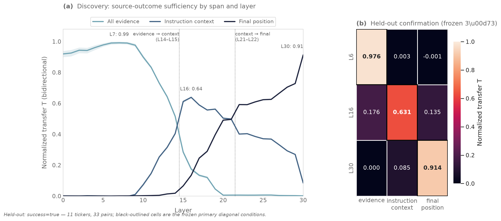
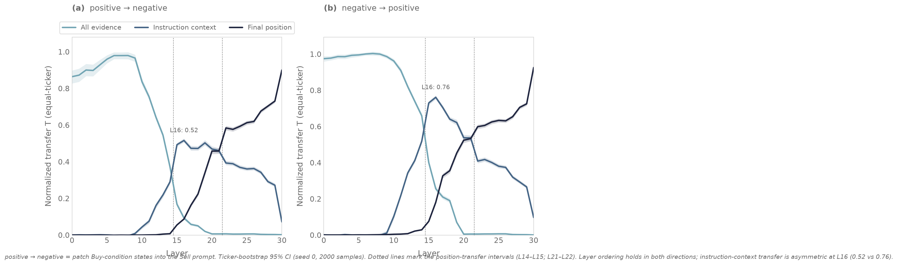

# Activation Patching Causal Tracing: Experiment Report

**Held-out verdict:** `success=true`

The protocol, patching definitions, artifact schema, and frozen confirmation gates are in
[the experiment proposal](proposal.md).

## Diagnostic Smoke Runs

These runs verify implementation and establish an upper bound. They use one
ADI discovery pair and do not support population-level or confirmatory claims.

### Phase 0

Run:

`artifacts/qwen3.5-4b/jspace-causal-tracing/runs/causal-trace-phase0-smoke-20260828`

The pair passed the clean gate:

- positive margin: `+5.389980`
- negative margin: `-5.937601`

### Phase 1 upper bound

Run:

`artifacts/qwen3.5-4b/jspace-causal-tracing/runs/causal-trace-phase1-minimal-smoke-20260828`

Patching all positions across L14–L26 flipped both directions:

| Direction | Target clean | Patched | Delta | Flip |
|---|---:|---:|---:|---|
| positive → negative | -5.937601 | +5.415966 | +11.353567 | yes |
| negative → positive | +5.389980 | -5.960407 | -11.350387 | yes |

The patched margins nearly reproduced the source clean margins. This confirms
that the L14–L26 all-position band provides a valid source-state transfer upper
bound for this pair.

### Phase 2 span diagnostic

Run:

`artifacts/qwen3.5-4b/jspace-causal-tracing/runs/causal-trace-phase2-span-smoke-20260828`

| Direction | Span | Delta | Flip |
|---|---|---:|---|
| positive → negative | all evidence | +4.651005 | no |
| positive → negative | qualitative evidence | +1.596579 | no |
| positive → negative | quantitative evidence | +1.325550 | no |
| positive → negative | header | 0.000000 | no |
| positive → negative | instruction | +11.185770 | yes |
| positive → negative | final position | +6.619417 | yes |
| negative → positive | all evidence | -7.118902 | yes |
| negative → positive | qualitative evidence | -2.088142 | no |
| negative → positive | quantitative evidence | -3.890133 | no |
| negative → positive | header | 0.000000 | no |
| negative → positive | instruction | -11.067641 | yes |
| negative → positive | final position | -7.225910 | yes |

For this pair, evidence states causally shift the margin but do not produce
symmetric flips. Post-evidence instruction states flip both directions and
nearly recover the source outcome. Header patching is an exact no-op, as
expected from causal-prefix identity. The discovery sweep must determine
whether this pattern holds across tickers.

## Phase 1 Discovery Result

Run:

`artifacts/qwen3.5-4b/jspace-causal-tracing/runs/causal-trace-phase1-discovery-20260830`

Status: completed discovery run. It is not held-out confirmation.

- 105 prepared pairs from 35 Technology tickers entered Phase 0.
- 104 pairs passed the clean-outcome gate.
- One KEYS pair failed because its positive prompt remained Sell-leaning
  (`M = -0.515882`; negative prompt `M = -6.185006`).
- The forward stage wrote 8,320 compact patch records.
- Runtime was 28 minutes 44 seconds on Qwen3.5-4B.

Every single-layer all-position condition produced 100% equal-ticker flip rate
in both directions from L4 onward. Positive→negative had slightly lower rates
at L0 (`0.9905`) and L1–L3 (`0.9810`). Negative→positive was 100% at every
layer.

Normalized transfer is

$$
T = \frac{M_{\mathrm{patched}} - M_{\mathrm{target}}}
         {M_{\mathrm{source}} - M_{\mathrm{target}}}.
$$

Equal-ticker mean bidirectional $T$ increased from `0.9197` at L0 to `0.9977`
at L14 and `0.9999` at L30. Mean absolute patched-to-source margin error fell
from about `1.06` at L0 to `0.15` at L14 and below `0.01` at L30.

This result establishes an all-position state-transfer upper bound. It does not
localize a unique decision layer: replacing every position after one block
makes the remaining forward pass behave like the source run, so late layers
almost reproduce the source margin by construction. Phase 2 therefore freezes
L14–L26 as the semantic-span discovery band. The choice uses the pre-existing
candidate band and the Phase 1 observation that all-position transfer has
already reached the near-complete source-outcome plateau by L14.

## Phase 2 Discovery Result

Run:

`artifacts/qwen3.5-4b/jspace-causal-tracing/runs/causal-trace-phase2-discovery-20260830`

Status: completed discovery run on the frozen L14–L26 band. The same 104 pairs
passed the clean-outcome gate, and the forward stage wrote 1,248 patch records.

All evidence patching moved every ticker in the source-outcome direction, but
its normalized transfer and discrete flips were asymmetric:

| Direction | Span | Mean delta | Mean normalized transfer | Equal-ticker flip rate |
|---|---|---:|---:|---:|
| positive → negative | all evidence | +4.401945 | 0.3708 | 0.0095 |
| negative → positive | all evidence | -7.870503 | 0.6601 | 0.9905 |
| positive → negative | qualitative evidence | +1.050084 | 0.0906 | 0.0095 |
| negative → positive | qualitative evidence | -3.834784 | 0.3241 | 0.2762 |
| positive → negative | quantitative evidence | +1.559078 | 0.1308 | 0.0000 |
| negative → positive | quantitative evidence | -5.065151 | 0.4255 | 0.5333 |
| positive → negative | final position | +7.400028 | 0.6197 | 0.8286 |
| negative → positive | final position | -7.545092 | 0.6311 | 0.9905 |
| positive → negative | instruction including final | +11.857183 | 0.9938 | 1.0000 |
| negative → positive | instruction including final | -11.856134 | 0.9938 | 1.0000 |

The header control produced no flips and a mean delta near zero in both
directions. All evidence, qualitative evidence, and quantitative evidence each
had 100% ticker-level directional consistency even when they did not cross the
decision boundary. The positive and negative clean margins were asymmetric
(mean `+5.128` versus `-6.805`), but margin distance alone does not explain the
full normalized-transfer asymmetry.

The Phase 2 `instruction` span includes the final decision position. A stricter
follow-up therefore added `instruction_context`, which excludes the final
position.

Follow-up run:

`artifacts/qwen3.5-4b/jspace-causal-tracing/runs/causal-trace-instruction-context-discovery-20260830`

| Direction | Mean delta | Mean normalized transfer | Equal-ticker flip rate |
|---|---:|---:|---:|
| positive → negative | +8.519363 | 0.7159 | 0.9905 |
| negative → positive | -10.339682 | 0.8654 | 1.0000 |

Thus, L14–L26 post-evidence instruction/assistant-prefix states are sufficient
to flip almost every eligible pair in both directions even when the final
decision-position state is never replaced. This establishes a causal state-
transfer result upstream of the output position. It does not yet localize the
layer where that sufficiency first appears.

## Phase 3 Layer × Span Discovery Result

Run:

`artifacts/qwen3.5-4b/jspace-causal-tracing/runs/causal-trace-phase3-layer-span-discovery-20260830`

Derived compact localization summary:

`artifacts/qwen3.5-4b/jspace-causal-tracing/runs/causal-trace-phase3-layer-span-discovery-20260830/analyze/phase3_localization.json`

Status: completed discovery run. The forward stage wrote 19,344 records for
L0–L30 × three span conditions × two directions. The derived summary averages
trials within ticker and direction, averages directions within ticker, then
reports equal-ticker normalized transfer with ticker bootstrap 95% CIs.

This document calls the interval where the largest sufficient state transfer
moves from one prompt region to another a **position-transfer interval**. This
is a descriptive label for resample-patching sufficiency, not an attention map,
mediation decomposition, or unique information route.

### Evidence positions

`all_evidence` transfer was already high at L0 (`0.9195`, CI
`[0.8988, 0.9389]`), peaked at L7 (`0.9912`), and remained above `0.97`
through L9. It then declined:

| Layer | Bidirectional normalized transfer | Bidirectional flip rate |
|---:|---:|---:|
| L10 | 0.8992 | 1.0000 |
| L12 | 0.7312 | 0.9429 |
| L14 | 0.5156 | 0.5000 |
| L15 | 0.2842 | 0.1786 |
| L18 | 0.1201 | 0.0048 |
| L20 | 0.0057 | 0.0000 |

Early-layer evidence states therefore carry sufficient source-outcome content,
while replacing evidence positions after L19 has almost no effect.

### Post-evidence instruction context

`instruction_context` was near zero through L9, increased from L10, peaked at
L16, and then declined:

| Layer | Bidirectional normalized transfer | Bidirectional flip rate |
|---:|---:|---:|
| L10 | 0.0734 | 0.0000 |
| L12 | 0.2523 | 0.0286 |
| L14 | 0.4041 | 0.4571 |
| L15 | 0.6114 | 0.5762 |
| L16 | 0.6386 | 0.5333 |
| L19 | 0.5624 | 0.5095 |
| L21 | 0.4983 | 0.5000 |
| L22 | 0.4009 | 0.1571 |
| L30 | 0.0844 | 0.0000 |

The evidence-to-instruction-context position-transfer interval lies between
L14 and L15: evidence transfer is larger at L14 (`0.5156` versus `0.4041`),
while instruction-context transfer is larger at L15 (`0.6114` versus
`0.2842`).

### Final decision position

Final-position transfer was near zero through L14, rose across L16–L21, then
became dominant:

| Layer | Bidirectional normalized transfer | Bidirectional flip rate |
|---:|---:|---:|
| L16 | 0.1340 | 0.0000 |
| L18 | 0.2895 | 0.0286 |
| L19 | 0.3966 | 0.4238 |
| L20 | 0.4910 | 0.5000 |
| L21 | 0.4958 | 0.5000 |
| L22 | 0.5916 | 0.8238 |
| L26 | 0.6254 | 0.9095 |
| L30 | 0.9131 | 1.0000 |

The instruction-context-to-final-position position-transfer interval lies
between L21 and L22. The two spans are approximately equal at L21 (`0.4983`
versus `0.4958`); final-position transfer exceeds instruction-context transfer
at L22 (`0.5916` versus `0.4009`).

Direction-specific transfer is asymmetric, especially for
`instruction_context`, but the layer ordering holds in both directions. At
L16, instruction-context normalized transfer is `0.5160` for positive→negative
and `0.7612` for negative→positive. At L30, final-position transfer is `0.9003`
and `0.9258`.

### Discovery interpretation

The Phase 3 result supports a distributed computation in which source-outcome
sufficiency is strongest at evidence positions in early layers, strongest at
post-evidence instruction positions in middle layers, and strongest at the
final decision position in late layers. Resample patching establishes that the
patched state is sufficient to transfer the fixed outcome margin. It does not
show that each region is necessary, that the model uses one route, or that the
patched state contains a discrete reasoning step.

## Calibration Result

Run:

`artifacts/qwen3.5-4b/jspace-causal-tracing/runs/causal-trace-confirmation-calibration-20260830`

Evaluation:

`artifacts/qwen3.5-4b/jspace-causal-tracing/runs/causal-trace-confirmation-calibration-20260830/analyze/confirmation_evaluation_v1.json`

All 36 pairs from 12 calibration tickers passed the clean-outcome gate. The
frozen matrix produced:

| Diagonal condition | Mean normalized transfer | Direction means |
|---|---:|---|
| L6 all evidence | 0.9884 | positive→negative 0.9699; negative→positive 1.0068 |
| L16 instruction context | 0.6395 | positive→negative 0.5117; negative→positive 0.7673 |
| L30 final position | 0.9129 | positive→negative 0.8978; negative→positive 0.9279 |

The row-dominance contrasts were `0.9894`, `0.4825`, and `0.8700`. Their
bootstrap 95% CIs were `[0.9721, 1.0050]`, `[0.4772, 0.4887]`, and
`[0.8658, 0.8739]`. Every calibration ticker had a positive contrast. Each
one-sided exact sign-flip p-value was `0.000244`; each Holm-adjusted p-value was
`0.000732`.

Calibration verdict: `success=true`; the unchanged frozen config authorized the
test run. No layer, span, threshold, contrast, or gate changed after discovery
or calibration.

## Held-Out Confirmation Result

Run:

`artifacts/qwen3.5-4b/jspace-causal-tracing/runs/causal-trace-confirmation-test-20260830`

Canonical evaluation:

`artifacts/qwen3.5-4b/jspace-causal-tracing/runs/causal-trace-confirmation-test-20260830/analyze/confirmation_evaluation_v1.json`

The test reused the frozen config unchanged. All 33 pairs from 11 held-out
Technology tickers passed the clean-outcome gate. All frozen gates passed and
the formal verdict is `success=true`.

### Held-out transfer matrix

| Layer | All evidence | Instruction context | Final position |
|---:|---:|---:|---:|
| L6 | **0.9756** | 0.0034 | -0.0007 |
| L16 | 0.1762 | **0.6314** | 0.1346 |
| L30 | 0.0001 | 0.0847 | **0.9136** |

The direction-specific means for the diagonal conditions were:

| Diagonal condition | positive→negative | negative→positive |
|---|---:|---:|
| L6 all evidence | 0.9562 | 0.9950 |
| L16 instruction context | 0.5211 | 0.7417 |
| L30 final position | 0.9030 | 0.9243 |

Every diagonal condition therefore had positive mean normalized transfer in
both directions.

### Held-out row dominance

| Contrast | Mean | Ticker-bootstrap 95% CI | Positive tickers | Exact p | Holm-adjusted p |
|---|---:|---:|---:|---:|---:|
| L6 evidence dominance | 0.9743 | [0.9515, 0.9926] | 11/11 | 0.000488 | 0.001465 |
| L16 context dominance | 0.4759 | [0.4606, 0.4922] | 11/11 | 0.000488 | 0.001465 |
| L30 final dominance | 0.8713 | [0.8686, 0.8739] | 11/11 | 0.000488 | 0.001465 |

The test passed the sample-size gate, all three diagonal transfer thresholds,
all three row-dominance thresholds, all three positive bootstrap-lower-bound
gates, the Holm-corrected exact tests, and all six direction-specific diagonal
transfer gates.

Discrete flips are secondary to the frozen normalized-transfer outcome. L6
all-evidence and L30 final-position patches flipped every held-out pair in both
directions. At L16 instruction context, negative→positive patches flipped every
pair, while positive→negative patches had an equal-ticker flip rate of `0.1212`.
The latter still had mean normalized transfer `0.5211` and positive context
row dominance for every ticker: it moved the fixed margin substantially in the
source direction without usually crossing the discrete boundary. The clean
positive and negative margins are asymmetric, so transfer and flip rate answer
different questions.

### Formal interpretation

The held-out result confirms the discovery-derived positional ordering for
Qwen3.5-4B on these Technology valence prompts:

1. At L6, source-outcome sufficiency is concentrated at evidence positions.
2. At L16, it is concentrated in post-evidence instruction/assistant-prefix
   positions even though the final decision position is excluded.
3. At L30, it is concentrated at the final decision position.

This is formal evidence for layer-dependent movement of resample-patching
causal sufficiency under the fixed Buy/Sell continuation-margin estimand. It is
not evidence that these sites are individually necessary, that they form a
complete mediation path, or that the model has one discrete reasoning route.

The evaluation is reproducible with:

```bash
uv run jspace-intervention analyze-activation-patching-confirmation \
  --records artifacts/qwen3.5-4b/jspace-causal-tracing/runs/causal-trace-confirmation-test-20260830/forward/phase3_records.jsonl \
  --baseline artifacts/qwen3.5-4b/jspace-causal-tracing/runs/causal-trace-confirmation-test-20260830/forward/phase0_baseline.jsonl \
  --config artifacts/qwen3.5-4b/jspace-causal-tracing/configs/position-transfer-confirmation-v1.json \
  --output /tmp/confirmation_evaluation.json \
  --split test
```

The canonical evaluation binds the patch records, baseline records, and frozen
config by SHA-256. It contains only compact derived metrics and provenance.

## Figures

`scripts/render_causal_tracing_figures.py` renders the discovery and held-out
confirmation result from compact artifacts only (no model, no raw activations):

```bash
uv run python scripts/render_causal_tracing_figures.py
```

Outputs (PDF+PNG plus `figures_provenance.json` with input SHA-256 binding and
aggregation parameters) go to `docs/assets/jspace-causal-tracing/`.



- Panel (a): bidirectional equal-ticker normalized transfer by layer for the
  three Phase 3 span conditions, with ticker-bootstrap 95% CIs from
  `phase3_localization.json`. Dotted lines mark the two position-transfer
  intervals (L14–L15, L21–L22); the held-out layers L6/L16/L30 anchor panel (b).
- Panel (b): the frozen 3×3 held-out confirmation matrix from
  `confirmation_evaluation_v1.json`; black-outlined cells are the frozen
  primary diagonal conditions.



The direction-split figure is a derived descriptive aggregation of the raw
Phase 3 discovery records, not a frozen outcome: pair values are averaged
within (ticker, layer, span, direction), tickers receive equal weight, and the
ticker-bootstrap 95% CI uses the same procedure as the frozen confirmation
evaluation (seed 0, 2000 samples). The renderer re-derives the bidirectional
equal-ticker means and requires them to match `phase3_localization.json` before
writing figures. It shows the layer ordering holds in both patching directions
and the instruction-context transfer asymmetry at L16 (`0.52` positive→negative
versus `0.76` negative→positive).

## Version History

| Version | Date | Status |
|---------|------|--------|
| Draft 1 | 2026-08-30 | Completed; discovery localized the position transfer, calibration passed, and the unchanged held-out confirmation returned `success=true` |
