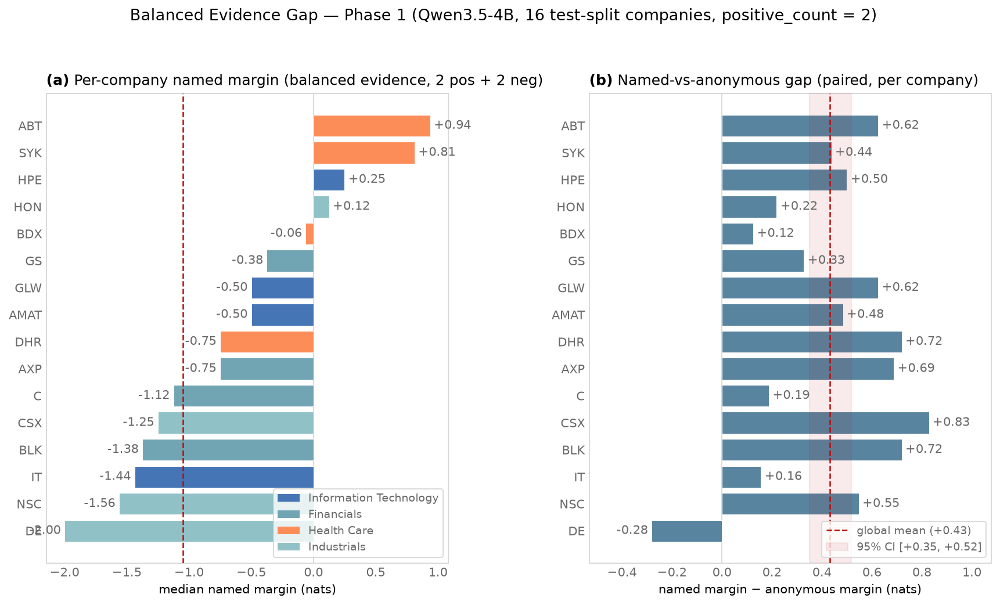

# Balanced Evidence Gap — Phase 1 行為確認報告

**狀態**：Phase 1 completed（2026-09-09）。三個描述性判準全數通過，授權進入
Phase 2 設計。  
**對象模型**：Qwen3.5-4B（bf16）。  
**協議**：[proposal](proposal-phase1.md)。

---

## 執行概覽

- **Run ID**：`balanced-gap-gpu-bf16-01`
- **Run root**：
  `artifacts/qwen3.5-4b/balanced-evidence-gap/runs/balanced-gap-gpu-bf16-01`
- **規模**：16 家 test-split 公司（4 sector × 4 家）× 4 repeats × 2
  reverse_options × 2 conditions（named / anonymous）= **256 條 prompt**
- **GPU 耗時**：437 s（含模型載入）
- **Operator**：`scripts/balanced_evidence_gap.py`（`--smoke` preflight 已通過）
- **Manifest**：`complete`，3/3 artifact SHA-256 核對通過
  （`prepare/prompts.jsonl`、`forward/results.jsonl`、`analyze/summary.json`）

## 三個描述性判準：全數通過

| 判準 | 門檻 | 觀測值 | 通過 |
|---|---|---|:---:|
| Cross-company named margin IQR | > 0.5 nats | **1.375 nats** | ✓ |
| Named-vs-anonymous gap 95% CI 不含 0 | bootstrap CI | **mean +0.432，CI [+0.350, +0.518]** | ✓ |
| Named vs. anonymous 決策翻轉 ≥ 2 筆 | — | **16/128 對**（15 sell→buy、1 buy→sell） | ✓ |

## 核心結果

### 匿名基線強偏空，公司名系統性地把 margin 推向 buy

- Anonymous（`[TICKER]` / `[Company X]`）：平均 margin **−1.049**，
  buy 決策 23/128（18%）。
- Named（真實公司名）：平均 margin **−0.617**，buy 決策 37/128（29%）。
- **15/16 家公司的 named-vs-anonymous gap 為正**（+0.125 至 +0.828），
  唯一例外是 DE（−0.281）：把匿名公司換上真實名稱，margin 多數向 buy
  方向移動，DE 是少數向 sell 方向移動的例外。

這與 J-space prior probe 的「零證據強 sell prior」一致，但本實驗顯示 entity
name 對該 prior 的修正量（≈ +0.43 nats）足以改變 12.5% 的離散決策。

### 公司間分歧巨大：DE −2.00 到 ABT +0.94

16 家公司的 named median margin 排序（完整值在
`analyze/summary.json`）：

| Ticker | Sector | named median margin | gap (named − anon) | flips |
|---|---|---:|---:|---:|
| DE | Industrials | −2.000 | −0.281 | 0 |
| NSC | Industrials | −1.562 | +0.547 | 1 |
| IT | Information Technology | −1.438 | +0.156 | 0 |
| BLK | Financials | −1.375 | +0.719 | 1 |
| CSX | Industrials | −1.250 | +0.828 | 0 |
| C | Financials | −1.125 | +0.188 | 0 |
| AXP | Financials | −0.750 | +0.688 | 2 |
| DHR | Health Care | −0.750 | +0.719 | 1 |
| AMAT | Information Technology | −0.500 | +0.484 | 1 |
| GLW | Information Technology | −0.500 | +0.625 | 2 |
| GS | Financials | −0.375 | +0.328 | 1 |
| BDX | Health Care | −0.062 | +0.125 | 4 |
| HON | Industrials | +0.125 | +0.219 | 0 |
| HPE | Information Technology | +0.250 | +0.500 | 2 |
| SYK | Health Care | +0.812 | +0.438 | 0 |
| ABT | Health Care | +0.938 | +0.625 | 1 |

Sector 層級（描述性，非 formal sector comparison）：Health Care
+0.234 > Information Technology −0.547 > Financials −0.906 >
Industrials −1.172。



**圖 1。** (a) 各公司 named median margin（依 sector 分色，紅色虛線為匿名
基線）；(b) 各公司 named-vs-anonymous gap（紅色虛線為全域 mean，淺紅帶為
bootstrap 95% CI）。Renderer：`scripts/plot_balanced_evidence_gap.py`。

## 限制與觀察

1. **Reverse-option framing effect 顯著**：同一公司同一 repeat 下，
   `"sell" or "buy"` 選項順序比 `"buy" or "sell"` 平均高 +0.606 nats
   （max 1.25）。named-vs-anonymous gap 是在相同 reverse option 下配對
   量測的，不受此效應污染；但任何跨 condition 的 margin 比較都必須控制
   reverse option。
2. **Cross-company IQR 混合了兩類來源**：named-vs-anonymous gap（同證據、
   只有名稱不同）是最乾淨的 entity effect；公司間 margin 分歧還包含各公司
   財務證據內容本身的差異。若要分離，Phase 2 需要 cross-entity probe
   （同一組證據、只換公司名）。
3. **本實驗是行為確認，非因果機制**：gap 存在只證明 entity name 改變決策
   分布，不說明是哪一層、哪些神經元造成的。
4. 16 家公司皆來自 S&P 500 2020–2025 成分（`test` split），未涵蓋非
   成分股或小市值公司。

## Phase 2 授權

三判準全過，授權設計 Phase 2 中間層 Path Patching 研究線。Phase 2 的
frozen 協議見 [proposal-phase2](proposal-phase2.md)：
(a) cross-entity probe：固定同一組 shared-evidence template、抽換公司名，
量測 pure entity margin；(b) entity-state layer sweep：L0–L31 × 4 span
的 residual resample patching，定位 entity position-transfer interval；
(c) handoff 區間內的 attention-edge zeroing 與 MLP margin attribution；
另含 L15/n8490 dial 激活量的 descriptive 相關性測量（H4）。

## 再現性

```bash
# smoke（無輸出檔案）
uv run --no-sync python scripts/balanced_evidence_gap.py \
    --smoke --model .cache/models/qwen3.5-4b

# 正式 run（約 7.5 分鐘）
CUDA_VISIBLE_DEVICES=0 HF_HUB_OFFLINE=1 TOKENIZERS_PARALLELISM=false \
uv run --no-sync python scripts/balanced_evidence_gap.py \
    --model .cache/models/qwen3.5-4b \
    --run-id balanced-gap-gpu-bf16-01

# 圖表
uv run --no-sync python scripts/plot_balanced_evidence_gap.py
```

Input：`data/baseline/investment-dial/exploratory-v1.json`（read-only，
`test` split 16 家公司的 4 組 evidence_pairs，seed=42 固定）。
