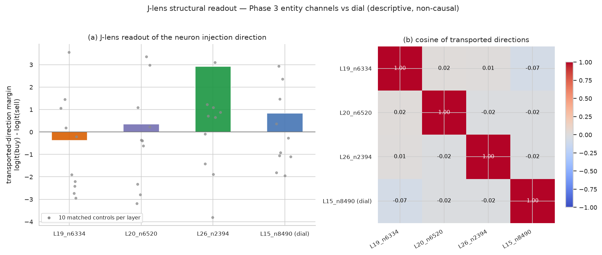

# J-lens neuron 結構診斷（Phase 3 座標收線後結構讀出）

Status: completed（formal run `phase3-jlens-neurons-03`，2026-09-10；
4/4 manifest hashes）。這是 [Phase 3](proposal-phase3.md) 收線後
的輔助結構診斷：descriptive、non-causal、first-order linear transport readout。
它不是新實驗協議，不重開任何 gate，也不改變
[Phase 3 報告](report-phase3.md) 的 verdict。

## 問題

Phase 3 已證實三個 2C entity-specific 通道（L19/n6334、L20/n6520、L26/n2394）
在 additive `mlp_addition` 介入下不勝過 matched controls（gate 3A：0/3
confirmed），不是決策的因果槓桿。本診斷回答另一個問題：**這些通道加進
residual stream 的方向，經 canonical Jacobian lens 運到 final-layer 空間
讀出的 vocabulary 結構是什麼**——每個 neuron 的方向性「語義簽章」。

## 方法（frozen）

1. **Input**：canonical lens（wikitext 校準，照用不 refit）＋ model weights。
   無 forward、無 prompt。
2. **Direction**：對 (L, n)，`w` = `down_proj_L.weight` 第 n 行（[d_model]；
   該通道每單位 activation 注入 residual stream 的方向；與 `mlp_addition`
   的 channel 索引相同）。
3. **Transport**：`T = lens.transport(w, L)`（lens 的 `J_L` 把 layer-L
   residual 映到 final-layer basis）。
4. **Decode**：`logits = unembed(T)`（final RMSNorm + lm_head + logit
   softcap，與 lens readout 同路徑；RMSNorm 使讀出 scale-invariant，
   即純方向性）。
5. **Readout（per coordinate）**：
   - `margin_buy_sell` = logits[buy_id] − logits[sell_id]；buy/sell 為 2A
     scoring prefix `{"decision": "` 後之單一 token continuation（與
     `answer_token_ids` 同一選法）。
   - `top10`：top 10 token id/text ＋ 全 vocabulary softmax 機率。
6. **座標**：3 個 entity candidate ＋ 1 個 dial（L15/n8490，positive
   control）＋ 40 個 matched controls（L15/L19/L20/L26 各 10 個，
   `random.Random(42+layer).sample(range(9216), 10)`，與 2C / Phase 3
   同一規則）。
7. **結構關係**：4 個主要座標 transported 方向兩兩 cosine；每個 entity
   candidate 對同層 10 個 control 的 max cosine。

## 邊界

- First-order linear transport readout；lens Jacobian 是 wikitext 校準
  corpus 的平均，非 chain-of-thought、非 discrete path、非 causal。
- 讀出對象是 neuron 的 isolated injection direction，不條件於任何特定
  prompt 或實際殘差狀態。
- 不重開 Phase 3 gate：即使讀出清晰的 stance 結構，也不重建立因果主張
  （Phase 3 null 維持）。
- Financial vocabulary 在 wikitext 校準下僅近似覆蓋。

## 輸出

`artifacts/qwen3.5-4b/balanced-evidence-gap-phase3/runs/<run-id>/`：
`prepare/provenance.json`、`analyze/summary.json`、`manifest.json`。
只有 compact 標量與 token id；不持久化任何方向向量。

## Reproducibility

```bash
CUDA_VISIBLE_DEVICES=0 HF_HUB_OFFLINE=1 TOKENIZERS_PARALLELISM=false uv run --no-sync python scripts/balanced_evidence_gap_jlens_neurons.py \
  --model .cache/models/qwen3.5-4b --run-id phase3-jlens-neurons-01

uv run --no-sync python scripts/plot_balanced_evidence_gap_jlens_neurons.py
```

## 結果（run `phase3-jlens-neurons-03`）

**三個 entity 通道都看不到可辨識的結構簽章；唯一的軟性 stance 訊號在 dial
positive control。**

### 三個 entity 通道的 isolated direction 都落在隨機對照範圍內

| Coordinate | margin（logit buy−sell） | 同層 control 範圍 | top-3 tokens |
|---|---|---|---|
| L19_n6334 | −0.3809 | −2.94 … +3.55 | manos / fibre / Fiber |
| L20_n6520 | +0.3557 | −3.19 … +3.35 | 村 / neighbor / 全村 |
| L26_n2394 | +2.9141 | −3.80 … +3.09 | ε / ω / λ |

- 三個 margin 全在對應層 10 個隨機 control 的 min–max 範圍內；buy/sell
  token 的機率質量全部 ≈ 0（訊號在 logit 層，不在機率層）。
- Top-10 tokens 沒有 stance、entity、sector 或 finance 內容：L19 為雜訊
  詞、L20 為 village/neighbor 語義簇、L26 為希臘字母。

### Dial positive control 顯示軟性正面情感結構，量級同樣在 control 範圍內

L15/n8490：margin +0.8286（L15 controls −1.95…+2.93），top tokens
圓滿 / ensuring / 穩健 / harmon。方法對已知功能座標能讀出方向上合理
（buy 向）的軟訊號；但即使是 dial，isolated-direction margin 也落在
control 範圍內。方法學意涵：isolated direction readout 是弱儀器——dial
的實際 ±1.0-nat 效應（Phase 3）來自與殘差狀態的交互，不能從 isolated
direction 單獨恢復。讀出只應解讀為結構傾向，不是效應量級。

### 四個 transported 方向近乎互相正交，無共享結構

- 主要座標離對角 |cosine| ≤ 0.065（2560 維隨機向量的預期水準
  ~1/√2560 ≈ 0.02）；entity 通道對同層 controls 的 max cosine ≤ 0.046。
- 三個 entity 通道在 vocabulary 空間指向互不相關的一般方向，也不對齊
  dial。

### Direction margin 符號與 Phase 3 realized intervention 極性一致

L19（margin −0.38，sell 向）對上 Phase 3 的 δ>0→sell；L26（margin
+2.91，buy 向）對上 Phase 3 的 δ>0→buy——兩組獨立觀測一致，且都與 2C
ρ 符號相反。L20（+0.36，弱 buy 向）與 Phase 3「無清晰極性」不矛盾。
這再次支持 [Phase 3 報告](report-phase3.md) 的方法論發現：2C
unsigned-attribution 的 Spearman 符號不是通道極性指標。

### 總解讀

First-order attribution 選出的三個「entity-specific」通道，在 J-lens
vocabulary 結構上與同層一般 down-projection 行不可區分。這與 Phase 3
的因果 null 一致：entity-induced gap 不是以可 push、語義可辨識的
單通道形式承載；J-lens 從另一角度（結構而非干預）給出同樣的圖景。


