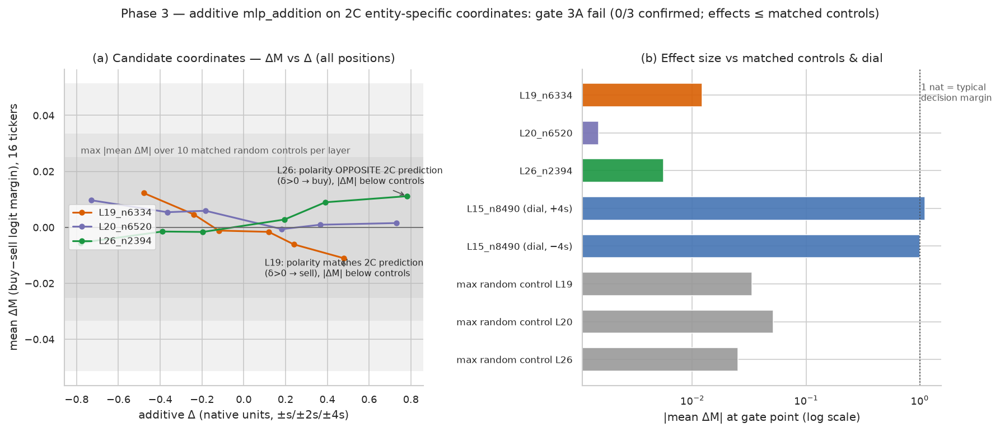

# Balanced Evidence Gap — Phase 3 報告：2C entity-specific MLP coordinate 的 causal validation

## 執行摘要

| 項目 | 值 |
|---|---|
| 模型 | Qwen3.5-4B（`/mnt/f/models/Qwen3.5-4B`，symlink `.cache/models/qwen3.5-4b`；hybrid Gated DeltaNet） |
| 協議 | [Phase 3 proposal](proposal-phase3.md)（Rev 2 frozen，2026-09-10） |
| Run ID | `phase3-gpu-bf16-02`（`phase3-gpu-bf16-01` 因 Rev 1 的 bit-exact 2C 重導檢查 fail-closed，改走 Rev 2 重跑） |
| 工件 | `artifacts/qwen3.5-4b/balanced-evidence-gap-phase3/runs/phase3-gpu-bf16-02/`（stages `prepare / pilot / intervene / analyze`；manifest `complete`，7/7 artifact hash 驗證） |
| 執行時間 | 30 分 11 秒（forward 約 1,376 次：pilot 80、intervene 1,296） |
| 狀態 | **completed** |
| Gate 3A | **FAIL（0/3 confirmed，門檻 ≥2）** |

## 核心結論

1. **Gate 3A fail（0/3 confirmed）**：三個 2C entity-specific coordinate（L19/n6334、L20/n6520、L26/n2394）在 additive `mlp_addition` 介入下，於預先指定的 gate δ 對 16 家公司 decision margin 的方向性因果效應全部不超過 matched random control channel（每層 10 個、seed 42+layer、與 2C control set 完全一致）。
2. **效應量級在 MLP 層擾動基線內**：gate 點 |mean ΔM| ≤ 0.012 nats，低於或與 random control 的 0.025–0.051 nats 同級；16/16 公司維持 sell，零 decision flip。任何通道被推 ±4s 都會讓 margin 移動 ~0.01–0.05 nats，這是該層通用擾動，不是 entity-specific 信號。
3. **Polarity 結果（descriptive）**：L19 實現極性符合 2C 預測（δ>0 → sell）；L26 實現極性與 2C 預測**相反**（δ>0 → buy），pilot 的 derivative diagnostic 已如設計在正式 gate 前 flag；L20 無清晰極性（pilot derivative ≈ 0）。2C unsigned attribution 的 Spearman 符號不是 channel polarity 的可靠指標。
4. **機制對照**：investment-dial 座標 L15/n8490 在同規模 ±4s 下移動 margin ±1.0–1.1 nats，比三個 candidate 大 ~100 倍。介入機制本身有效；entity channel 的可操縱效應相對已知的 model-level stance 座標可忽略。

## Pilot 驗證（rev 2 容差）

**2C 重導驗證**（48 次 differentiable forward，重導 per-neuron Spearman 對照 2C 存檔）：3 層全過。

| 層 | 重導 top | \|ρ\|（重導 vs 2C） | candidate \|Δρ\| | control max \|Δρ\| |
|---|---|---|---|---|
| L19 | 6334 | 0.8882 vs 0.8971 | 0.0088 | 0.0324 |
| L20 | 6520 | 0.8941 vs 0.8941（bit-exact） | 0.0000 | 0.0382 |
| L26 | 2394 | 0.8588 vs 0.8588（bit-exact） | 0.0000 | 0.0000 |

**Baseline 驗證**：16 家 canonical prompt 的 margin 與 2A 存檔 bit-exact（max abs diff = 0.0）。

**Scale s**（pilot 前向、entity span 位置、|a| 的 90 分位數，native units）：L19 0.1196、L20 0.1826、L26 0.1953、dial 0.1354。

**Derivative diagnostic**（16 家、position-summed dM/da，descriptive、不 gate）：

| Coordinate | mean dM/da | predicted（2C ρ 符號） | sign match |
|---|---|---|---|
| L19_n6334 | −0.02893 | −1（sell） | True |
| L20_n6520 | −0.00175 | +1（buy） | False（近零） |
| L26_n2394 | +0.01156 | −1（sell） | False（相反） |

## Gate 3A 結果

Gate δ 取各 candidate 的 predicted 方向 ×4s。direction = sign(mean ΔM at gate δ) 對照 predicted 方向；consistency = 單邊二項（n=16，p0=0.5）＋ Holm（m=3）；control superiority = 勝過同層 10 個 matched control 的 max |mean ΔM|（control 只測 ±4s 兩點）。

| Candidate | predicted | gate δ | mean ΔM | n_same | raw p | adj p | control max | direction | consistency | control | pass |
|---|---|---|---|---|---|---|---|---|---|---|---|
| L19_n6334 | sell | −0.4785 | **+0.0122** | 7/16 | 0.7728 | 1.0 | 0.0334 | ✗ | ✗ | ✗ | **FAIL** |
| L20_n6520 | buy | +0.7305 | +0.0015 | 8/16 | 0.5982 | 1.0 | 0.0514 | ✓ | ✗ | ✗ | **FAIL** |
| L26_n2394 | sell | −0.7812 | −0.0056 | 11/16 | 0.1051 | 0.3152 | 0.0252 | ✓ | ✗ | ✗ | **FAIL** |

confirmed = 0/3（門檻 ≥2）→ **Gate 3A fail**。

**協議方向判據的內部矛盾（記錄在案）**：frozen 協議 §2 定義 predicted direction 為「δ>0 產生的 margin 方向」（ρ<0 → sell），§4.1 同時指定 sell candidate 的 gate δ = −4s。對 ρ<0 的 candidate，若假說成立，δ=−4s（反向推）應使 margin 向 buy 方向移動，與「gate 點觀察值符號 = predicted 方向」的判據矛盾。實作採用字面判據（sign(mean ΔM at gate) = sign(ρ)）。改採自洽讀法（gate 點預期符號恆為 +1）時：L19 direction 翻為 ✓ 但 consistency（9/16，adj p=1.0）與 control superiority 仍 fail；L26 direction 翻為 ✗；L20 不變。**line-level verdict（0/3）對兩種讀法不變。**

## 完整 ΔM(δ) 曲線（16 家平均，descriptive）

| Δ | L19_n6334 | L20_n6520 | L26_n2394 |
|---|---|---|---|
| +4s | −0.0110 | +0.0015 | +0.0111 |
| +2s | −0.0061 | +0.0009 | +0.0089 |
| +s | −0.0016 | −0.0007 | +0.0028 |
| −s | −0.0012 | +0.0059 | −0.0017 |
| −2s | +0.0046 | +0.0054 | −0.0015 |
| −4s | +0.0122 | +0.0097 | −0.0056 |

- L19：兩側符號清晰（+δ → sell、−δ → buy），與 2C 預測極性一致；4s 處 0.011 nats，first-order ratio 0.8–0.9（線性近似的合理範圍）。
- L26：兩側符號清晰但與 2C 預測相反（+δ → buy）；4s 處 0.011 nats。
- L20：兩側符號混雜、量級 ≤0.010，無清晰因果方向。

**Sector 均值（gate 點）**：L19 四個 sector 全 +（+0.0094…+0.0153）；L20 與 L26 跨 sector 符號混雜。16 家全部維持 sell（baseline margin −1.05…−2.57），零 flip。

**Dial 對照**：L15/n8490 在 −4s_dial → mean ΔM = −1.0006；+4s_dial → +1.1115。



## 解讀

- **2C 的 correlational 發現沒有轉譯成可 push 的因果效應。** 2C 的 first-order local attribution 捕捉到「channel 影響幅度與 ticker margin 相關」的相關結構，但把該通道推 4 個 activation 標準差只移動 margin ~0.01 nats，與推隨機通道無異。16 家公司 pure entity margin 的 1.5-nat 展開（−1.05…−2.57）不透過這三個 channel 以可偵測形式因果傳遞。
- **ρ 符號不是 polarity 指標**：L26 的實現極性與 2C ρ 符號相反。2C 的 attribution 是 unsigned 的（|∂M/∂a|·|a|），Spearman 符號反映「margin 範圍哪一端 attribution 較強」，與「推高通道會讓 margin 往哪走」沒有必然關係。這與 proposal §2 明示的預設（high influence ↔ 推 toward ticker 自己的 margin 方向）不符；pilot derivative diagnostic 按設計在正式 gate 前捕捉了 L26 的翻轉。
- **MLP 層擾動基線**：L19–26 的任一通道被推 ±4s 都會移動 margin ~0.01–0.05 nats。這個量級是模型層級的通用擾動底噪；任何「entity-specific」的斷言必須先勝過這層底噪，三個 candidate 都未勝過。
- **與 financial-soundness 線同形**：該線同樣「無 candidate 勝過 control」。兩條獨立線在同一模型、同一類 first-order-attribution 發現上給出相同的 null，支持把 first-order attribution 視為發現（discovery）工具而非因果定位工具。

## 限制

1. **All-position 介入語義**：`mlp_addition` 在所有 token 位置加同一 δ（與 investment-dial 慣例一致），而 2C attribution 在 entity position 量測。若 channel 的效果只集中於 entity position，all-position 推注會把部分 δ 分流到無關位置，稀釋可偵測效應。dial 對照（±1.0 nats）顯示機制本身不是瓶頸，但 entity-position-only 版本（另建新版本協議）是未排除的替代設計。
2. **n=16**：16 家 test split 公司。consistency 門檻 13/16 在 n=16 下對 ~0.5–0.6 方向的效應也缺乏 power；本結果是「未偵測到超過 control 的效應」，不是「效應為零」的证明。
3. **Single grid anchor**：gate 只讀 gate δ 一點（防 snoop）；曲線點為 descriptive，不排除其它 δ 有更大的效應（本曲線在 ±4s 端點最大，無此跡象）。
4. **模型與語言單一**：Qwen3.5-4B、英文 prompt；泛化到其它模型/語言未測。
5. **Pilot derivative 的構念差異**：position-summed dM/da 與 entity-position attribution 不是同一量，sign match 只是 sanity check。

## Reproducibility

```bash
# formal run
CUDA_VISIBLE_DEVICES=0 HF_HUB_OFFLINE=1 TOKENIZERS_PARALLELISM=false uv run --no-sync python scripts/balanced_evidence_gap_phase3.py \
  --model .cache/models/qwen3.5-4b \
  --phase2a-run artifacts/qwen3.5-4b/balanced-evidence-gap-phase2/runs/phase2a-gpu-bf16-01 \
  --phase2c-run artifacts/qwen3.5-4b/balanced-evidence-gap-phase2/runs/phase2c-gpu-bf16-05 \
  --phase2c-reanalysis-run artifacts/qwen3.5-4b/balanced-evidence-gap-phase2/runs/phase2c-gate-reanalysis-01 \
  --run-id phase3-gpu-bf16-02

# smoke（4 tickers，全 4 stages）
CUDA_VISIBLE_DEVICES=0 ... uv run --no-sync python scripts/balanced_evidence_gap_phase3.py ... --smoke --run-id phase3-smoke-04

# figure
uv run --no-sync python scripts/plot_balanced_evidence_gap_phase3.py
```

Run directory 內：`prepare/provenance.json`（上游 3 run 的 manifest SHA-256）、`pilot/summary.json`（重導驗證、scale、derivative、baseline check）、`intervene/records.jsonl`（1,296 筆 compact records）、`analyze/summary.json`（gate 3A ＋ descriptive）。所有記錄通過 `llm_bias/core/artifacts` 的 IO guard（不含 raw activation）。

## 狀態與後續

- **Phase 3 line 以 null 收線**：2C 發現維持 discovery 性質；無 coordinate 通過 causal validation。
- 未預授權的候選後續（都需另建新版本協議）：entity-position-only 干預版本；其它層（2B sweep 的 L0–11 entity-state 帶）的 coordinate 篩選＋驗證；多模型/多語言泛化。
- 對下游的含義：balanced-evidence-gap 線（Phase 1–3）的最終產出是**行為確認（Phase 1）＋ 狀態與組件的定位證據（Phase 2，discovery）＋ 第一組定位座標的 causal null（Phase 3）**。entity-induced gap 的因果路徑仍需新的定位方法，first-order attribution 單獨不足以收口。
