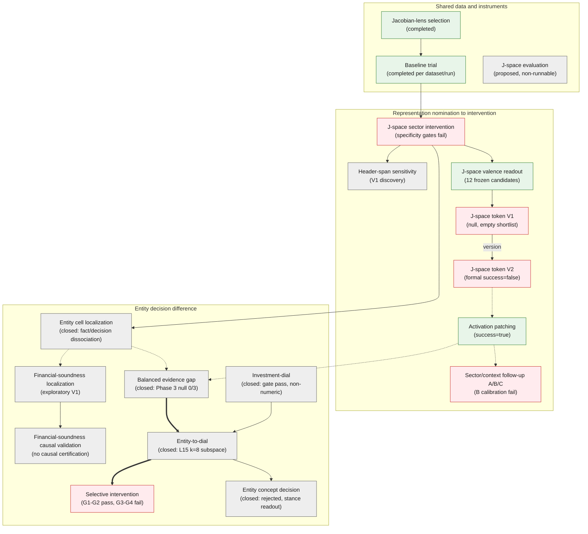

# Spec: README.md 研究地圖（Research map）

批次變更 spec（/batch）。目標：在 root `README.md` 新增一張 mermaid
`flowchart`（TB 方向＋三個 subgraph 研究分支）研究地圖，一眼呈現全部
active 實驗的主軸（三條研究線的推進與匯流）、分支與各實驗的最新 gate
結論；依賴邊只畫主軸上游（本 spec 明定 17 條，其中 16 條出處見
`docs/README.md` 關係表，1 條為線內版本繼承），完整關係表仍以
[research map table](../README.md) 為 source of truth。

## 背景與範圍

- 使用者要求：視覺化「目前做的所有實驗」；先以 subagent 整理每個實驗的一句
  話說明（這是什麼實驗、做了什麼、得到的結論），再以這些資訊做心智圖。
- 圖型選 `flowchart TB`＋subgraph（而非 mindmap），依使用者於計畫呈報時
  明確改選（可畫依賴邊、三帶分層仍滿足「一眼看出主軸、分支」）。
- 節點 click 已移除：GitHub 以 `viewscreen.githubusercontent.com` iframe
  渲染 mermaid，`click` 相對路徑會 404、絕對 URL 被 CSP 阻擋（GitHub
  community discussion #46096 實證），在主展示平台等同無效；導航由
  圖下方的 Documentation map 連結清單承擔。本地渲染器（VS Code 等）若
  日後需要 click 可再加回。
- 布局採純 `flowchart TB`（不带內 `direction LR`）：混合方向在 dagre
  下造成跨 subgraph 連線撕裂與節點折返；三帶垂直堆疊、帶內隨邊自然
  排序。視覺通道收斂（依視覺化設計審查）：節點 3 色（綠 ok／紅 neg／
  灰 neutral，合併原 closed 與 wip）、邊只用線型（實線／虛線／粗實線
  `==>`）、不用 `linkStyle` 邊色（index 脆弱＋無色環境退化）。
- 圖面文字用英文（與 `README.md` 文件語言一致）；一句話中文說明記錄在本
  spec 的目錄中，供查核與回覆使用者。
- 排除在圖外：`archive/` 凍結線（counterfactual、synthetic、10-K）、
  `shared-experiment-core` 等 infra、`interactive-prompt-lens-dashboard`
  等工具、以及 `j-space-evaluation` 以外的非實驗項目。`j-space-evaluation`
  保留為節點（屬研究項目）但標 proposed/non-runnable。

## 實驗目錄（18 項，subagent 盤點結果）

分支分組與 `docs/README.md` 的三張表一致：①共用資料與儀器、②從表徵提名到
介入與位置定位、③從事實記憶、立場調控追查實體決策差異。

| # | 節點標籤（L1） | 描述（L2） | 結論（L3） | docs 目錄 | 一句話說明（中文） |
|---|---|---|---|---|---|
| 1 | Baseline trial | trial-plan inputs and per-layer lens readout | (completed per dataset/run) | `baseline-trial` | 共用輸入重現 pipeline：trial-plan prompts 走 readout/forward/lens-forward/backward/validate 各階段驗證產物契約；完成狀態依 dataset/run 獨立結案（4B 5 層解碼 24→4 分鐘且數值一致）。 |
| 2 | Jacobian-lens selection | canonical lens for Qwen3.5-4B | (completed) | `jacobian-lens-selection` | 以 32 對語意 pairs＋bootstrap／permutation 測試為 Qwen3.5-4B 挑選唯一 active canonical lens；chinese_simplified 獲選為 operational winner，但 holdout 不確定區間跨 0，尚非統計顯著驗證。 |
| 3 | J-space evaluation | task-local candidate preflight | (proposed, non-runnable) | `j-space-evaluation` | synthetic task-local J-space 候選證據的儀器性前置協議；僅 proposal 規格，未實作未執行，不 gate 任何 milestone。 |
| 4 | J-space sector intervention | sector coordinate swap and gain | (specificity gates fail) | `jspace-sector-intervention` | 在 L14–L26 對科技／金融產業座標施加小劑量 swap/gain，測試決策轉移的產業與位置特異性；held-out 未通過兩項特異性 gate，安全劑量下無決策翻轉。 |
| 5 | J-space valence readout | positive/negative vocabulary nomination | (12 frozen candidates) | `jspace-valence-readout` | 用 canonical lens 在 L14–L26 證據結尾位置解碼完整詞彙 softmax，提名跨實體一致的正負 valence 詞彙；12 個 token 過 consistency 門檻（如 upgrade／risks），屬表徵候選非因果證據。 |
| 6 | Header-span sensitivity | ticker/name swap behavior screen | (V1 discovery) | `span-sensitivity` | 固定財務證據下變異 header 的 ticker/名稱（7 種條件）測 Buy/Sell margin；`same_sector_swap` ΔM=−1.3857、12/35 翻轉過 discovery，但表面字形對照亦顯著，calibration/test 未凍結。 |
| 7 | J-space token V1 | vocabulary-direction steering | (null, empty shortlist) | `jspace-token-experiments`（V1） | 對 valence readout 提名的 12 個詞彙方向做對稱小劑量 steering 並對照 matched random 方向；0/12 過 shortlist gate，shortlist 空，正式收線為 null。 |
| 8 | J-space token V2 | outcome-gradient decision flips | (formal success=false) | `jspace-token-experiments`（V2） | 沿決策輸出梯度擬合 outcome-conditioned 方向在中間層 steering 測試翻轉；formal `success=false`（Buy 9/9 過、Sell 僅 2 個合格 ticker 檢定力不足；final-position control 也 100% 翻轉）。 |
| 9 | Activation patching | evidence-to-context-to-final transfer | (success=true) | `activation-patching-causal-tracing` | 層級式 residual resample patching 掃 Layers×semantic spans 的充分性轉移；held-out confirmation `success=true`：L6 證據（T=0.9756）→ L16 指令上下文（0.6314）→ L30 最終位置（0.9136）。 |
| 10 | Sector/context follow-up A/B/C | header and context patching, L16 readout | (B calibration fail) | `sector-context-followup` | 承接 patching 發現做 A 跨產業 header 抽換、B 負面證據下指令前綴抽換、C L16 context readout；discovery 全完成，B V1 calibration `success=false`（same-sector peer 效應大於跨產業，特異性未過），held-out 未執行。 |
| 11 | Entity cell localization | 4 company fact cells | (closed: fact/decision dissociation) | `entity-cell-localization` | 多句式激活定位承載公司事實的單一 MLP 神經元並做抑制因果驗證；V3 確認 4 顆獨立 entity cell（JNJ/BAC/CAT/PLTR），壓制造成事實記憶崩塌但買賣決策 0 翻轉，事實與決策功能解離；E4 residual 解碼為 proposed probe。 |
| 12 | Financial-soundness localization | financial-judgment neuron screen | (exploratory V1) | `financial-soundness-localization` | 以 234 對題型掃描全層找財務穩健度特異反應通道；72 個候選方向性重現，但判斷對答案形式極敏感，formal run 未授權。 |
| 13 | Financial-soundness causal validation | intervention on candidate neurons | (no causal certification) | `financial-soundness-causal-validation` | 對 72 個候選神經元施加縮放抑制與 donor 替換；margin 變化全落隨機對照底噪、無實質翻轉，未建立財務特異性因果認證（formal 未授權）。 |
| 14 | Investment-dial | Park et al. 2026 single-neuron dial | (closed: gate pass, non-numeric) | `investment-dial` | 在開源模型復現 Park et al. (2026) 的 L15/N8490 單神經元投資立場 dial；V2 formal gate pass（RMSE 0.0579，翻轉單向不可逆），fine-a 證實 V1 失敗為粗採樣 artifact；屬方法復現非 numeric replication。 |
| 15 | Balanced evidence gap | entity-induced decision gap | (closed: Phase 3 null 0/3) | `balanced-evidence-gap` | 確認平衡證據下實體身份誘發決策落差的行為與層級路徑，並因果驗證晚期神經元；Phase 1 pass（置換名稱最多 1.5 nats 偏移）、Phase 2 定位 L0–11 承載帶／L12–15 交接／L15 峰值、Phase 3 gate 0/3 confirmed 虛無。 |
| 16 | Entity-to-dial | entity signal path dissection | (closed: L15 k=8 subspace) | `entity-to-dial` | 解剖 entity signal 從 L0–11 承載帶到 L15 決策層的路徑，排除 entity token／單一 block／dial 通道；E1 pass（k=8 子空間恢復 98.3% full-swap 效應）、F1 fail（下游非線性飽和），最終採納 L15 k=8 殘差子空間描述。 |
| 17 | Selective intervention | L15 subspace removal at inference | (G1-G2 pass, G3-G4 fail) | `selective-intervention` | 推論期移除 L15 k=8 entity-difference 子空間以消除 entity-induced 決策偏誤；group gap −53.8%、IQR 半減、子空間特異性成立（G1a/G1b/G2 pass），但 full-strength 伴隨全局 stance 推注（+0.33 nats，G3/G4 fail）→ full-strength 負結果。 |
| 18 | Entity concept decision | separable company concept test | (closed: rejected, stance readout) | `entity-concept-decision` | 測試公司身分與投資決策之間是否存在可與通用 stance 分離的中間概念；原假說被否決（候選方向綁定 stance 軸），收斂描述為 1D stance 方向於 L15 解釋 margin 變異 60% 但非 entity signal、因果為弱槓桿，決策是 0.5% 公司間差的高增益非線性讀出。 |

## Unit 1：README.md 新增 `### Research map` 小節

**檔案邊界**：只改 `README.md`。不得改任何其他檔案。

**位置**：`## Documentation map` 內、五條頂層 nav bullets（最後一條為
`- [Research scripts reference](docs/research-scripts.md)`）之後、
`### Research design and planning` 之前。

**插入內容**（逐字；縮排與換行照抄）：

````markdown
### Research map

The map below groups the active experiments into the three research branches
used in the [research map table](docs/README.md): shared data and
instruments, representation nomination to intervention, and the entity
decision difference line. Node colors: green gate pass or completed, red
gate fail or null, gray otherwise (line closed, exploratory, or proposed).
Edges mark major upstream relations only: solid data/artifact dependency,
dashed research succession or method reference, and thick solid lines mark
the main convergence axis. The full relationship table with provenance
stays in [docs/README.md](docs/README.md); archived frozen lines are not
shown (see [archive/](archive/README.md)). Node names match the
experiments linked in the sections below.


````

**節點標籤**：flowchart 節點標籤使用上表的「節點標籤（L1）」＋「結論
（L3）」兩行（L2 描述不入圖）；node id 與上表編號對照：1 bt、2 jls、3
jse、4 jsi、5 jvr、6 hss、7 jtv1、8 jtv2、9 ap、10 scf、11 ecell、12
fsloc、13 fscv、14 dial、15 beg、16 e2d、17 sel、18 ecd。

**邊清單**（17 條；出處為 `docs/README.md` 關係表，僅 `jtv1 -->
jtv2` 為線內版本繼承，`docs/README.md` 明定 V1→V2 線內順序見頂層
proposal）：

| # (0-based) | 邊 | 樣式 | 關係 |
|---|---|---|---|
| 0 | jls --> bt | solid | 資料／產物依賴 |
| 1 | bt --> jsi | solid | 資料／產物依賴 |
| 2 | jsi --> hss | solid | 資料／產物依賴 |
| 3 | jsi --> jvr | solid | 資料／產物依賴 |
| 4 | jsi --> ecell | solid | 資料／產物依賴 |
| 5 | jvr --> jtv1 | solid | 資料／產物依賴 |
| 6 | jtv1 --> jtv2 | solid, `version` label | 線內版本繼承 |
| 7 | jtv2 -.-> ap | dashed | 研究承接 |
| 8 | ap -.-> scf | dashed | 研究承接 |
| 9 | ecell -.-> fsloc | dashed | 方法參考 |
| 10 | fsloc --> fscv | solid | 資料／產物依賴 |
| 11 | ecell -.-> beg | dashed | 研究承接 |
| 12 | ap -.-> beg | dashed | 研究承接 |
| 13 | beg ==> e2d | thick solid | 資料／產物依賴（主收斂軸） |
| 14 | dial --> e2d | solid | 資料／產物依賴 |
| 15 | e2d ==> sel | thick solid | 資料／產物依賴（主收斂軸） |
| 16 | e2d --> ecd | solid | 資料／產物依賴（proposed） |

關係表其餘 16 條次要上游（jls→jsi、bt→jvr、jls→jvr、jsi→jtv1/jtv2、
jls→jtv1/jtv2、bt→ap、jsi→scf、jls→scf、jls→ecell、dial→beg、
jtv1/jtv2→beg、ap→e2d、beg→sel、dial→sel、beg→ecd、jls→ecd）為次要
上游，為維持圖面可讀性省略；caption 已註明「only major upstream
relations」。保留的敘事關鍵邊：`ecell -.-> beg`（解離發現促成平衡證據
之問）、`jsi --> hss` 與 `ecell -.-> fsloc`（側枝錨定，避免浮動節點）。

**驗收標準**：

1. `README.md` 出現新的 `### Research map` 小節，位置在上述錨點之間；
   其餘 README 內容零改動（diff 只有新增）。
2. mermaid block 通過 mermaid.js parse，`diagramType === "flowchart-v2"`。
3. 圖結構：3 個 subgraph（標題逐字為 `Shared data and instruments`、
   `Representation nomination to intervention`、`Entity decision
difference`）、18 個節點（標籤＝上表 L1＋L3，node id 對照表如上述）。
4. 17 條邊與「邊清單」逐條一致（含 `jtv1 -->|version| jtv2`、兩條
   `==>` 粗線）；3 個 `classDef`（ok/neg/neutral）；無 `click`、無
   `linkStyle`、無 `direction LR`。
5. caption 兩個相對連結（`docs/README.md`、`archive/README.md`）存在且從
   root 解析正確。

6. `git diff --name-only` 只列出 `README.md`（另可有 untracked 的
   `docs/dev/research-map_spec.md`，屬本 spec 自身）。

## 驗證指令（Unit 1）

```bash
cd /home/novis/Projects/llm-bias

# (a) mermaid 語法：從 README.md 抽出 ```mermaid block 並 parse
probe=/tmp/mermaid-probe
if [ ! -d "$probe/node_modules" ]; then
  mkdir -p "$probe" && cd "$probe" && npm init -y >/dev/null 2>&1
  npm i mermaid jsdom --no-audit --no-fund --loglevel=error
fi
cd "$probe" && node --input-type=module -e "
import { readFileSync } from 'fs';
import { JSDOM } from 'jsdom';
const dom = new JSDOM('<!DOCTYPE html><body></body>');
globalThis.window = dom.window; globalThis.document = dom.window.document;
const { default: mermaid } = await import('mermaid');
const md = readFileSync('/home/novis/Projects/llm-bias/README.md','utf8');
const m = md.match(/\`\`\`mermaid\n([\s\S]*?)\`\`\`/);
if (!m) { console.error('FAIL: no mermaid block'); process.exit(1); }
try {
  const r = await mermaid.parse(m[1]);
  console.log('MERMAID OK', r.diagramType);
} catch (e) { console.error('MERMAID FAIL', e.message.split('\n').slice(0,3).join(' | ')); process.exit(1); }
"

# (b) 節點數 = 18
md=/home/novis/Projects/llm-bias/README.md
awk '/^```mermaid/{f=1;next} /^```/{f=0} f' "$md" | grep -cE '^\s+[a-z0-9]+\["'

# (c) classDef 數 = 3；click/linkStyle 數 = 0
awk '/^```mermaid/{f=1;next} /^```/{f=0} f' "$md" | grep -c '^  classDef '
awk '/^```mermaid/{f=1;next} /^```/{f=0} f' "$md" | grep -cE '^  (click|linkStyle)'

# (d) 邊數 = 17（含 --> 與 ==>）
awk '/^```mermaid/{f=1;next} /^```/{f=0} f' "$md" | grep -cE '^\s+[a-z0-9]+ (==>|-->|-\.->)'

# (e) 三個 subgraph 標題逐字存在
for b in 'subgraph INSTR["Shared data and instruments"]' 'subgraph INTERV["Representation nomination to intervention"]' 'subgraph ENTITY["Entity decision difference"]'; do
  grep -qF "$b" "$md" || echo "MISSING SUBGRAPH: $b"
done

# (f) caption 相對連結（從 README.md 所在目錄解析）
cd /home/novis/Projects/llm-bias
for p in docs/README.md archive/README.md; do
  test -f "$p" || echo "BAD LINK: $p"
done

# (g) 變更邊界
git diff --name-only
git status --short
```

預期：(a) 印 `MERMAID OK flowchart-v2`；(b) 印 `18`；(c) 印 `3` 與 `0`；
(d) 印 `17`；(e)/(f) 無輸出；(g) 只有 `README.md`（modified）與
`docs/dev/research-map_spec.md`（untracked）。

## Out of scope

- 不新增其他文件、不改 `docs/README.md` 或任何 experiment 文件。
- 不畫關係表未列的連線；主軸邊之外的次要上游不畫（維持 `docs/README.md`
  關係表為完整關係的唯一來源）。
- 不改 `AGENTS.md`、不加 lint 腳本到 repo（驗證腳本為 /tmp throwaway）。
- 不做 archive 線的任何呈現。
