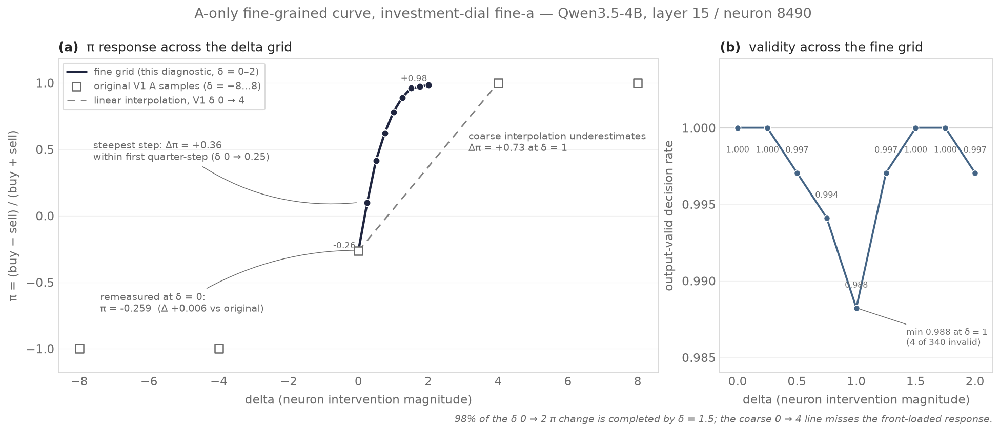

# A-only fine-grained curve diagnostic 報告

## 文件狀態

本文件記錄 A-only fine-grained curve diagnostic（protocol version
`investment-dial-fine-a-v1`）的第一次正式 run。這是 auxiliary diagnostic operator
的 diagnostic run：它不改變 V1 calibration coefficients、不是新的 calibration
method、不執行 B/test generation、candidate selection 或 coefficient refitting，
`certified=false`。完整操作文件與 interpretation limits 見
[A-only diagnostic](diagnostic-fine-a.md)。結果：zero 附近有 steep transition，
支持（但不單獨證明）coarse-interpolation explanation；Δ=0 重測與 original A
幾乎一致。

- Run ID：`fine-a-gpu-bf16-01`
- Run root：`artifacts/qwen3.5-4b/investment-dial-fine-a/runs/fine-a-gpu-bf16-01`
- 狀態：diagnostic（completed；manifest 所有 stage `complete`）
- 所屬實驗線：investment-dial，為 Park et al.（2026，arXiv:2608.22852）的
  investment-bias dial 方法復現；paper provenance 與已知差異見
  [線 README](README.md)

## 摘要

- Fine 格網（δ=0–2）的 pi 變化 98% 在 δ=1.5 前完成，最陡一步在 δ 0→0.25
  （Δpi=+0.359）：zero 附近的 steep transition 支持（但不單獨證明）
  coarse-interpolation explanation。
- 粗格網 (0, −0.2647) → (4, +1.0) 的 linear interpolation 在 δ=1 低估
  measured pi 達 +0.730：原 0→4 兩點之間確實漏掉了陡峭段。
- Δ=0 重測與 original A 僅差 1 筆 prompt（Δpi=+0.0059），全格網
  output-validity rate 0.988–1.000：硬體差異與 parse 失敗都不構成干擾。
- 依協議未選擇新 calibration rule 或 gate、未覆寫 V1 coefficients，
  certified=false。

## Input 與 provenance

- Source run（完整 original V1 calibration run）：
  `artifacts/qwen3.5-4b/investment-dial-calibration/runs/exploratory-v1-20260907-07-gpu0-calibration`
  （parent manifest SHA-256 `173cc0cf29c6cd4c2980a87ea95bb0eb72bb467824644687c33c6dddcb6d5ff3`）。
  該 source run 依 [A-only diagnostic](diagnostic-fine-a.md) 的 transfer 要求從原始
  server 複製，5 個檔案（manifest 與全部 registered outputs）的 SHA-256 與來源端一致。
- Selected coordinate：layer index 15、neuron index 8490（zero-based），與 V1
  selected coordinate 相同。
- Generated subset：只有 split A 且 `positive_count == 2` 的 rows：340 prompts、
  85 companies。Parent 的其他 splits 未被生成或寫入。
- Fixed deltas：0, 0.25, 0.5, 0.75, 1, 1.25, 1.5, 1.75, 2（9 × 340 = 3,060 次
  greedy generation，maximum 256 new tokens，unchanged JSON decision/reason
  prompts，original intervention placement）。
- 驗證：run 前通過 model/tokenizer identity、parent hashes、tokenization 與
  software/dtype/chat-template 相容性檢查；本機的 checkpoint（8.8 GB，2 shards）
  10 個檔案逐一與 parent 記錄的 identity hashes 相符。
- 硬體差異：本次在與原始 server 不同的硬體（NVIDIA RTX 3060，12 GB）上執行。
  依協議，hardware/device 差異被允許且記錄；torch 2.9.1+cu128、transformers
  5.14.1、bfloat16、chat template 皆與 parent runtime 相同。差異可能改變
  generated decisions，因此 delta=0 的重測值只作 descriptive comparison，
  不是 exact-equality gate。

## 結果

`analyze/result.json` 的 per-delta 摘要（完整 finite 數值與 pi 見該檔）：

| delta | buy | sell | pi | valid decision rate | parse rate | schema rate |
|---:|---:|---:|---:|---:|---:|---:|
| 0.00 | 126 | 214 | −0.2588 | 1.0000 | 1.0000 | 1.0000 |
| 0.25 | 187 | 153 | +0.1000 | 1.0000 | 1.0000 | 1.0000 |
| 0.50 | 240 | 99 | +0.4159 | 0.9971 | 1.0000 | 0.9971 |
| 0.75 | 274 | 64 | +0.6213 | 0.9941 | 1.0000 | 0.9941 |
| 1.00 | 299 | 37 | +0.7798 | 0.9882 | 0.9941 | 0.9882 |
| 1.25 | 320 | 19 | +0.8879 | 0.9971 | 1.0000 | 0.9971 |
| 1.50 | 333 | 7 | +0.9588 | 1.0000 | 1.0000 | 1.0000 |
| 1.75 | 335 | 5 | +0.9706 | 1.0000 | 1.0000 | 1.0000 |
| 2.00 | 336 | 3 | +0.9823 | 0.9971 | 1.0000 | 0.9971 |

Invalid decisions 共 10 筆（δ=0.5、1.25、2.0 各 1 筆；δ=0.75 兩筆；δ=1.0 四筆；
其餘 grid points 為 0），全部保留在 `forward/delta-*.jsonl`，並依定義從 pi 的
分母排除。

## Delta=0 對照 original A（descriptive comparison）

Original A（V1 calibration 的 delta=0 樣本）：buy=125、sell=215、
pi=−0.2647058824。本次重測：buy=126、sell=214、pi=−0.2588235294（Δpi=+0.0059，
等同 1 筆 prompt 的差別）。零點附近沒有 Broad runtime differences，因此硬體
差異不構成歸因上的干擾。

## 曲線特性

- 最陡的一步在 δ 0 → 0.25（Δpi=+0.359），其次 0.25 → 0.5（+0.316），之後的
  增量單調遞減（+0.205, +0.158, +0.108, +0.071, +0.012, +0.012）。
- δ 0 → 2 的總 pi 變化有 98% 在 δ=1.5 之前完成（0.9588 對 0.9823 的終點）；
  δ ≥ 1.5 後曲線接近飽和。
- Original V1 grid 是 [−8, −4, 0, 4, 8]。以 (0, −0.2647) → (4, +1.0) 的
  linear interpolation 為參照，它在 δ=1 低估 measured pi 達 Δpi=+0.730、
  δ=2 低估 +0.591。Fine-grained curve 呈現 zero 附近的 steep transition 與
  早期飽和，支持（但不單獨證明）coarse-interpolation explanation：V1 的
  delta=4 樣本已落在飽和區，而不是在 steep transition 上。
- 所有 grid points 的 output-validity rate 介於 0.988 與 1.000，沒有明顯
  下降；pi 的走勢不是 parse 或 schema 失敗造成的。

## Interpretation limits

依 [A-only diagnostic](diagnostic-fine-a.md) 的固定契約：

- 本 diagnostic 不預設或預先建立任何 cause 歸屬；steep transition 只支持
  coarse-interpolation explanation，不單獨證明它。
- 沒有在看到結果後選擇任何新的 calibration rule 或 accuracy gate；calibration
  或 gate 的變更需要 separately versioned protocol 與 fresh evaluation。
- 本 diagnostic 不覆寫 V1 coefficients、不 claim certified success，所有 invalid
  generations 保留在 artifacts。

## 圖



**圖 1。** 左：fine-grained π curve（δ=0–2，深色線與圓點）與 original V1 A
samples（δ=−8…8，灰色空心方塊）、V1 δ 0 → 4 linear interpolation（灰色虛線）。
右：每個 fine delta 的 output-valid decision rate（參考線 1.0；最低點 δ=1，
4/340 invalid）。

圖表 provenance：

- Renderer：`scripts/plot_fine_a_curve.py`（直接讀取兩個 run 的 compact
  artifacts，不含 raw tensors）
- Input runs：`fine-a-gpu-bf16-01` 的 `analyze/result.json`，以及 parent
  calibration run 的 `prepare/protocol.json`（deltas）與
  `analyze/result.json`（selected A_curve）
- 重建：

```bash
uv run --with matplotlib --with seaborn --with numpy --with pandas \
  scripts/plot_fine_a_curve.py
```

## Reproducibility

GPU 命令（依 [A-only diagnostic](diagnostic-fine-a.md)；本機 `--model` 指向
`.cache/models/qwen3.5-4b` 的 symlink，目標為 `/mnt/f/models/Qwen3.5-4B`）：

```bash
CUDA_VISIBLE_DEVICES=0 HF_HUB_OFFLINE=1 TOKENIZERS_PARALLELISM=false \
uv run --no-sync python scripts/investment_dial_fine_a.py \
  --model .cache/models/qwen3.5-4b \
  --source-run artifacts/qwen3.5-4b/investment-dial-calibration/runs/exploratory-v1-20260907-07-gpu0-calibration \
  --run-id fine-a-gpu-bf16-01 --device cuda
```

沒有 automatic resume；interrupted run 需要新 run ID。本 run 全程未中斷
（manifest：2026-09-08T15:46:30Z 開始、21:50:09Z finalize，約 6 小時 4 分；
含 model loading 的 process wall time 約 6 小時 12 分）。

相關 commits：

- `062e812`：feat(investment-dial): add portable A-only fine-curve diagnostic

驗證：

```bash
uv run pytest -q tests/test_investment_dial_fine_a.py tests/test_investment_dial.py
```

（本 run 前後各執行一次，28 tests passed；tests 使用 mocked inference。）
