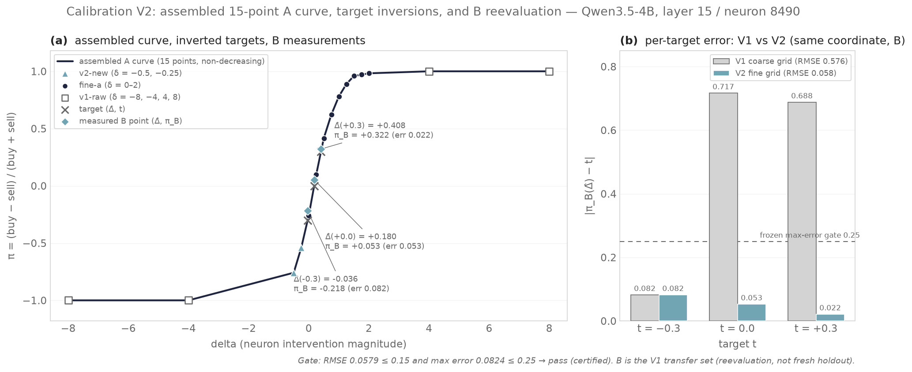
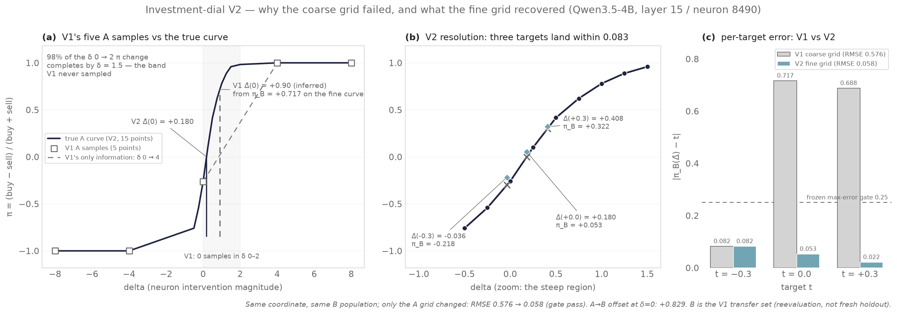

# Investment-dial calibration V2 report（fine-grid 重校準與 B reevaluation）

**檔案狀態**：本報告對應 protocol `investment-dial-calibration-v2` 的第一次
formal run（`calib-v2-gpu-bf16-01`，2026-09-09，local）。**結論：gate
verdict 為 `pass`（B reevaluation RMSE 0.0579，max residual 0.0824，
`certified=true`）；在同一 coordinate 上，V1 的粗 grid calibration 失敗
（RMSE 0.5757）被 fine-grid inversion 修正，支持 coarse-interpolation
explanation。**Paper provenance 與版本矩陣見
[README](README.md)。

## 摘要

- Run `calib-v2-gpu-bf16-01` 完成全部 2,040 次 generation（A 負側 680＋
  B 1,360），9 個 registered artifacts 全部通過 manifest hash 驗證，
  `status=complete`。
- 組裝 15 點 A curve（v1-raw 4 點、fine-a 9 點、v2-new 2 點）通過
  monotonicity pre-check（non-decreasing）；`inverse_curve` 給出
  Δ̂(−0.3)=−0.0365、Δ̂(0)=+0.1803、Δ̂(+0.3)=+0.4083。
- B reevaluation 三個 target 的 error 為 0.0824、0.0529、0.0215，全部
  validity/parse/schema rates ≥ 0.988（無 degraded 點）；RMSE 0.0579 ≤
  0.15 且 max error 0.0824 ≤ 0.25 → gate `pass`、`certified=true`。
- 解釋邊界：B 是 V1 用於 coordinate ranking 的 transfer set，本結果是
  reevaluation 而非全新 held-out confirmation；`test` split（86 家）未使用。
  Coordinate 未重選，故失敗不能唯一歸因 grid 的 confound 在本次（通過）
  不影響結論方向，但「coordinate 次優」的可能性仍存在。

## Run 與 provenance

- **Run ID**：`calib-v2-gpu-bf16-01`
- **Run root**：`artifacts/qwen3.5-4b/investment-dial-calibration-v2/runs/calib-v2-gpu-bf16-01`
- **Protocol**：`investment-dial-calibration-v2`；protocol SHA-256
  `619703f0b8634e6f99099c153136dc831eafa2c9723a70bd89d1f485c82b4e1e`
- **Operator**：`scripts/investment_dial_calibration_v2.py`（SHA-256
  `e4dcf6e266daf5bce840ebae137ae600d4513c550191079ca07eec672ab8b7b6`）
- **Source identity**：git commit `062e812dd21af363a1bf1891840c162c38fb9d2f`；
  source SHA-256 `78fe6025b12165ae76efc1dbe88515b73a459fa76b3d6fb6c7efefafe9b696b9`
- **Parent runs**（皆通過 manifest hash 與 identity 驗證）：
  - V1 calibration：
    `artifacts/qwen3.5-4b/investment-dial-calibration/runs/exploratory-v1-20260907-07-gpu0-calibration`
    （manifest SHA-256 `173cc0cf29c6cd4c2980a87ea95bb0eb72bb467824644687c33c6dddcb6d5ff3`）
  - Fine-a diagnostic：
    `artifacts/qwen3.5-4b/investment-dial-fine-a/runs/fine-a-gpu-bf16-01`
    （manifest SHA-256 `ab8a6cb19a594584381218793c245d856e1f4ed7c601f4d6ede5f8983bc61957`）
- **Model**：`.cache/models/qwen3.5-4b`（Qwen3.5-4B，checkpoint/tokenizer
  hashes 與兩個 parent 記錄的 identity 一致，含
  `chat_template_sha256 12de9034d5269e8b1fe6012b3538374fcb3941bf93c95fc81b0cf5acf3f08ce4`）
- **Runtime**：torch 2.9.1+cu128、transformers 5.14.1、torch.bfloat16、
  cuda:0（RTX 3060）——與兩個 parent 記錄的 runtime 一致
- **Timeline**（local）：11:39 啟動 → 13:12 A 負側 680 筆完成、curves 組裝
  與 inversion 完成 → 13:57 B baseline → 14:43 B −0.3 target → 15:28
  B 0 target → 16:12 B +0.3 target 完成、analyze/finalize（總 4h33m）
- **Smoke preflight**：`--smoke` 先於 formal run 執行，PASS（parent guards
  與 2 筆 A/B 生成的 parse/schema 檢查），未寫入任何 run 目錄
- **Generation 筆數**（與 protocol budget 一致）：
  `a-negative.jsonl` 680、`b-baseline.jsonl` 340、
  `b-target-minus-0-3.jsonl` 340、`b-target-0.jsonl` 340、
  `b-target-plus-0-3.jsonl` 340；每檔 85 個 distinct tickers
- 沒有 automatic resume；本 run 一次完成，中斷重跑需新 run ID

## A curve 組裝與 inversion

15 點（每點 n=340；π=(buy−sell)/(buy+sell)，分母為 valid 數）：

| δ | source | buy | sell | valid | π |
|---:|---|---:|---:|---:|---:|
| −8.0 | v1-raw | 0 | 337 | 337 | −1.000000 |
| −4.0 | v1-raw | 0 | 340 | 340 | −1.000000 |
| −0.5 | v2-new | 41 | 299 | 340 | −0.758824 |
| −0.25 | v2-new | 78 | 262 | 340 | −0.541176 |
| 0.0 | fine-a | 126 | 214 | 340 | −0.258824 |
| 0.25 | fine-a | 187 | 153 | 340 | +0.100000 |
| 0.5 | fine-a | 240 | 99 | 339 | +0.415929 |
| 0.75 | fine-a | 274 | 64 | 338 | +0.621302 |
| 1.0 | fine-a | 299 | 37 | 336 | +0.779762 |
| 1.25 | fine-a | 320 | 19 | 339 | +0.887906 |
| 1.5 | fine-a | 333 | 7 | 340 | +0.958824 |
| 1.75 | fine-a | 335 | 5 | 340 | +0.970588 |
| 2.0 | fine-a | 336 | 3 | 339 | +0.982301 |
| +4.0 | v1-raw | 340 | 0 | 340 | +1.000000 |
| +8.0 | v1-raw | 338 | 0 | 338 | +1.000000 |

- v1-raw 四點依 frozen rule 從 V1 `effects.jsonl` 以現行 `summary()` 重算
  （不採用 V1 stored summaries）；δ=8 點重算後 π=+1.0，消除 stored 值
  0.994117 的不一致。
- 新量測負側兩點：δ=−0.5 → π=−0.7588、δ=−0.25 → π=−0.5412；負側同樣
  front-loaded（δ −4→0 區間內 π 從 −1.0 升到 −0.26）。
- Monotonicity pre-check：non-decreasing，`passed=true`。
- Inversion（`llm_bias.investment_dial.analysis.inverse_curve`，strict、
  無 extrapolation）：

| target | Δ̂（full precision） |
|---:|---|
| −0.3 | −0.036458333333333315 |
| 0.0 | +0.180327868852459 |
| +0.3 | +0.40826330532212884 |

## B reevaluation（primary outcome）

B population：V1 split B，340 筆、85 家（`positive_count == 2`）——即 V1
calibration 用於 candidate ranking 的同一 transfer set（reevaluation 口徑，
非全新 held-out）。

| target | Δ̂ | buy | sell | valid | π_B(Δ̂) | error | valid/parse/schema rate |
|---:|---:|---:|---:|---:|---:|---:|---|
| — | 0.0（baseline） | 141 | 199 | 340 | −0.170588 | — | 1.000 / 1.000 / 1.000 |
| −0.3 | −0.036458 | 133 | 207 | 340 | −0.217647 | 0.082353 | 1.000 / 1.000 / 1.000 |
| 0.0 | +0.180328 | 179 | 161 | 340 | +0.052941 | 0.052941 | 1.000 / 1.000 / 1.000 |
| +0.3 | +0.408263 | 224 | 115 | 339 | +0.321534 | 0.021534 | 0.997 / 1.000 / 0.997 |

- **RMSE = 0.057875**、**max error = 0.082353**
- Gate（pre-registered）：RMSE ≤ 0.15 ✓ 且 max error ≤ 0.25 ✓；無 degraded
  點（所有 rates ≥ 0.9）→ **`gate_verdict="pass"`、`certified=true`**
- 描述性檢查（不入 gate）：三個 B 點 monotone ordering
  （−0.218 < +0.053 < +0.322）✓；B baseline π(0)=−0.171 與 A 側
  π(0)=−0.259 相差約 +0.088（B 略偏 buy），inversion 的 target errors
  仍全部 ≤ 0.083

## 決策翻轉（描述性，per-prompt）

上述 π 變化為宏觀聚合量；以下為同一批 artifacts 的 per-prompt 翻轉統計（無新生成）。
分析方法：以 prompt id 對齊各 prompt 於不同干預強度 δ 下之決策輸出。在同機 greedy
確定性解碼條件下，δ=0 自然構成無干預之反事實基準，故決策翻轉係由神經元干預實質
誘發，排除抽樣隨機雜訊之干擾；無效決策（invalid）則獨立列計。

**A 側**（fine-a 9 點＋ v2-new 負側；n=340）：

| 對照 | sell→buy | buy→sell | 不變 | invalid 涉及 |
|---|---:|---:|---:|---:|
| δ 0 → 0.25 | 61 | 0 | 279 | 0 |
| δ 0 → 0.5 | 114 | 0 | 225 | 1 |
| δ 0 → 1.0 | 173 | 0 | 163 | 4 |
| δ 0 → 1.5 | 207 | 0 | 133 | 0 |
| δ 0 → 2.0 | 210 | 0 | 129 | 1 |
| δ 0 → −0.25 | 0 | 48 | 292 | 0 |
| δ 0 → −0.5 | 0 | 85 | 255 | 0 |

- 隨正向干預強度遞增，決策翻轉完全呈現由 sell 轉為 buy 之單向性（累計 210/340 =
  62%）；負向干預則全數呈現 buy 轉為 sell；全程未觀察到任何反向翻轉。
- **各 prompt 翻轉行為具備嚴格單調性**：全數 340 題 prompt 在 9 點網格掃描中，
  翻轉後復歸現象為 0/340，展現鮮明之臨界閾值開關特性。
- 相鄰 quarter-step 之翻轉數分別為 61、53、34、25、17、12、2 與 1（相鄰步進
  總和 205 略小於累計翻轉 210，係因 5 題 prompt 於中間過渡階數輸出無效決策，
  未計入相鄰步進對齊）。

**B 側**（以 baseline δ=0 之原始狀態為對照基準；baseline 為 141 題 buy / 199 題 sell，立場指標 π = −0.171；n=340）：

| 目標點 | 達成方向需求 | sell→buy | buy→sell | 不變 | 其他（invalid） |
|---|---|---:|---:|---:|---:|
| Δ̂(−0.3) = −0.036 | 需比基線更悲觀（推向 −0.3） | 0 | 8 | 332 | 0 |
| Δ̂(0) = +0.180 | 需推回多空平衡（推向 0.0） | 38 | 0 | 302 | 0 |
| Δ̂(+0.3) = +0.408 | 需大幅轉向多頭（推向 +0.3） | 83 | 0 | 256 | 1 |

B 側翻轉方向與各目標相對於基線之移動需求完全一致（更偏空則僅有 buy→sell，更偏多則僅有 sell→buy），且未出現任何逆向震盪。邊界約束：本分析未配置
對照神經元組（control-neuron arm）。以 δ=0 作為反事實對照足以證實翻轉現象之
真實性；但若欲進一步主張「唯獨此特定神經元能引發翻轉」之因果特異性，則需於後續
評估階段引入對照組檢驗。

## 與 V1 的比較

同一 coordinate（L15/n8490）、同一 B population，只改 A 取樣 grid 與
inversion 方法（V1：5 點粗 grid 的 cubic fit；V2：15 點細 grid 的
`inverse_curve`）：

| target | V1 π_B | V1 error | V2 π_B | V2 error |
|---:|---:|---:|---:|---:|
| −0.3 | −0.382353 | 0.082353 | −0.217647 | 0.082353 |
| 0.0 | +0.716814 | 0.716814 | +0.052941 | 0.052941 |
| +0.3 | +0.988235 | 0.688235 | +0.321534 | 0.021534 |
| **RMSE** | **0.575694** | | **0.057875** | |

V1 在中性與正向目標（neutral、+0.3）上實測之 π 均大幅偏高，與「三次多項式擬合
在 δ ∈ [0, 4] 區間誤判曲線形狀，導致反推干預量 Δ̂ 嚴重過衝」之幾何機制完全吻合。
V1 之 `result.json` 未保存各目標之 Δ̂ 實測值（僅留存擬合係數），以下數值係依實測
結果回推之描述性估計（非 V1 原始存檔欄位）：V1 於中性目標量得之 B 組 π 為 +0.7168，
對照 V2 組裝之 15 點曲線，對應之干預強度約達 δ ≈ +0.90（若再扣除 A→B 組基線偏移量
+0.088，則約對應 δ ≈ +1.06）。換言之，V1 當時實際施加之 Δ̂(0) 約達真實需求量
（+0.180）的 5 至 6 倍，根因在於粗網格在 δ 0 至 4 之間僅測得端點變化，擬合演算法
誤判立場轉移為平緩過渡所致。此外，負向目標（−0.3）在兩版中均相對貼近目標，兩者誤差
巧合地皆為 28/340 = 0.0824（即各自分佈偏離目標恰好 28 題 prompt）。

## 解釋與限制

**核心解釋**：在 Qwen3.5-4B 上，investment-dial 的校準精度受限於 A transfer
curve 的取樣解析度，而非 model 或 coordinate 本身；解析出 δ≈−0.5–1.5 的
陡峭區間後，target stance 可以以 ≤0.08 的誤差 transfer 到 B reevaluation set。

1. **H1（grid artifact）獲支持**：fine-grid inversion 在固定 coordinate 上
   把三個 target 的 B error 全部壓到 ≤ 0.083。這是 V1 失敗的預備解釋，
   與 fine-a diagnostic 的「front-loaded steep transition」證據一致。
2. **Reevaluation 口徑**：B 曾參與 V1 的 coordinate ranking，本結果不構成
   對未知公司（`test` split，86 家）的 generalization 證據；那需要 v3
   或獨立 evaluation stage。
3. **Coordinate 未重選**：V2 通過不排除該 coordinate 非最優；但若 V2
   失敗，也不能唯一歸因 grid（proposal §6 的 confound 對稱約束）。
4. **A→B transfer 偏移**：A baseline（−0.259）與 B baseline（−0.171）
   相差 +0.088，小於 gate 容差；inversion 只用 A curve，未做 A/B
   修正。
5. **有效調節區間狹窄與閾值開關特性**：三個目標立場對應之 Δ̂ 高度集中於
   −0.036 至 +0.408 區間（跨度僅約 0.45 個單位 δ）；曲線於 |δ| ≥ 4 時已達
   極端飽和（±1.0），高靈敏度之過渡區間僅分佈在 δ ≈ −0.5 至 1.5。這從幾何特性
   解釋了粗網格擬合必然失敗的根因，亦說明未來若需更高精度的立場調節，必須依賴密集
   取樣或另擇更平緩之神經元坐標。此外，−0.3 目標之 Δ̂ ≈ −0.04 幾乎貼近零點，係因
   A 組基線立場本身已偏向空頭（π = −0.259），推移至 −0.3 僅需極微量之負向干預。
6. **Reproduction 邊界**（vs Park et al. 2026）：本 model（Qwen3.5-4B）
   非論文模型、n=340 vs 論文 427-ticker 宇宙、coordinate 由本地 V1 選出；
   RMSE 0.0579 不與論文 0.038 直接比較。本 run 只對應論文 Table 2/3 的
   calibration 口徑，不涉及 RQ3/agentic/capability-preservation。
7. **語義邊界**：dial 是 model-level stance prior 的 intervention，非
   sector- 或 entity-targeted control，也非 standalone causal claim。

## 圖



**圖 1。** (a) 組裝 15 點 A curve（以 source 區分：▲ v2-new、● fine-a、□
v1-raw）與三個 Δ̂ 的 vertical dashed 線、target 標記（×）與 B 測量點（◆）；
(b) V1 vs V2 的 per-target error（0.25 為 frozen max-error gate）。



**圖 2。** (a) V1 的 5 點粗 grid 對照真實 A curve：灰色帶為 V1 完全沒取樣的
δ 0–2 區間，dashed 線是它在這段唯一的資訊（δ 0→4 直線）；兩條垂直線對出
Δ̂(0) 的差距：V2 真值 +0.180 vs 由 V1 B neutral 測量（π=+0.7168）反推的
V1 Δ̂(0) ≈ +0.90（描述性估計，非 V1 存檔值）；(b) 陡峭區間 zoom，三個
target 全部命中（error ≤ 0.083）；(c) per-target error 對比。

圖表 provenance：

- Renderer：`scripts/plot_calibration_v2.py` 與
  `scripts/plot_calibration_v2_explained.py`（皆直接讀取 run 的 compact
  artifacts，不含 raw tensors）
- Input runs：`calib-v2-gpu-bf16-01` 的 `forward/a_curve.json` 與
  `analyze/result.json`；V1 parent run 的 `analyze/result.json`
  （selected B_stats / A_curve）

## 再現性

```bash
# preflight（已完成，PASS；不寫 run 目錄）
CUDA_VISIBLE_DEVICES=0 HF_HUB_OFFLINE=1 TOKENIZERS_PARALLELISM=false \
uv run --no-sync python scripts/investment_dial_calibration_v2.py \
  --model .cache/models/qwen3.5-4b \
  --v1-run artifacts/qwen3.5-4b/investment-dial-calibration/runs/exploratory-v1-20260907-07-gpu0-calibration \
  --fine-a-run artifacts/qwen3.5-4b/investment-dial-fine-a/runs/fine-a-gpu-bf16-01 \
  --run-id calib-v2-gpu-bf16-01 --device cuda --smoke

# formal run（已完成，exit 0）
CUDA_VISIBLE_DEVICES=0 HF_HUB_OFFLINE=1 TOKENIZERS_PARALLELISM=false \
uv run --no-sync python scripts/investment_dial_calibration_v2.py \
  --model .cache/models/qwen3.5-4b \
  --v1-run artifacts/qwen3.5-4b/investment-dial-calibration/runs/exploratory-v1-20260907-07-gpu0-calibration \
  --fine-a-run artifacts/qwen3.5-4b/investment-dial-fine-a/runs/fine-a-gpu-bf16-01 \
  --run-id calib-v2-gpu-bf16-01 --device cuda
```

Run artifacts 由 manifest 鎖定（本報告撰寫時 9 個 artifacts 全部
hash-verified、stages 全部 `complete`）；重跑需新 run ID。
