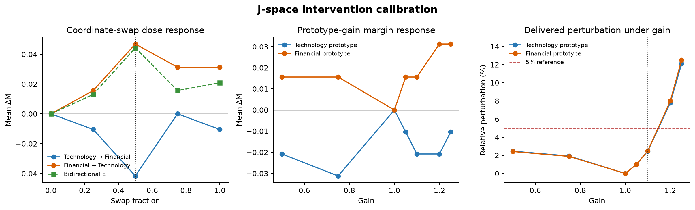
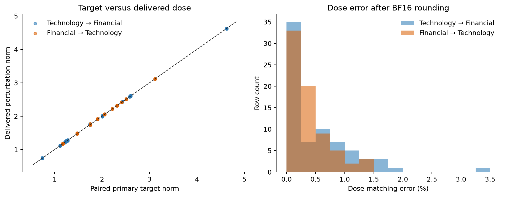
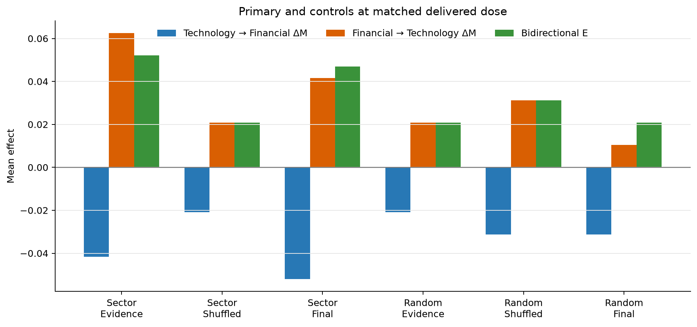

# J-space 產業介入實驗：方法、校準與初步結果

## 文件狀態

本文件整理 Qwen3.5-4B 在 Technology（科技）與 Financial Services（金融服務）之間的 J-space 介入校準結果。目前尚未執行 held-out test，因此本文不提出 held-out causal claim；test tickers 仍未使用。

目前的實驗顯示：在候選 workspace layer band 施加小幅介入，會改變模型對固定 continuation `buy` 與 `sell` 的機率差，但現有 controls 尚未證明效果只來自指定產業座標與 evidence positions。

## 摘要

- 獨立 layer localization 將 **L14–L26** 選為候選 workspace band。
- 初始 dose sweep 中，`swap_fraction = 0.5` 的雙向 coordinate swap 效果最大。
- Sector-prototype gain 的安全候選上限為 `gain = 1.10`。
- `gain ≥ 1.2` 與完整 swap 的多層累積擾動過大，因此不納入主要 held-out test。
- 安全劑量會改變 buy/sell margin，但目前沒有任何 prompt 發生 Buy ↔ Sell preference sign flip。
- v3 paired-primary controls 已把 absolute perturbation norm 的平均誤差控制在 0.6% 以下。
- Final-position 與其他 controls 也會改變 margin，因此目前尚未隔離出 evidence-position-specific sector effect。

## 研究問題與主要 outcome

對產業 A 的公司 prompt，我們將產業 A 的 J-space 座標替換為產業 B 的座標，觀察模型的 Buy/Sell 分布是否朝產業 B 的方向移動。第二個實驗則放大 prompt 中已存在的產業 prototype coordinate。

主要分數定義為

\[
M = \log P(\text{buy}) - \log P(\text{sell}),
\]

介入效果為

\[
\Delta M = M_{\text{intervened}} - M_{\text{clean}}.
\]

正值代表機率朝 `buy` 移動，負值代表朝 `sell` 移動。目前 workflow 評估固定 Buy/Sell continuations，尚未在介入狀態下重新生成完整文字答案。

## 資料切分與 leakage control

資料以 ticker 為單位切分，避免同一家公司同時出現在 discovery、calibration 與 test。

| 產業 | Discovery | Calibration | Test |
|---|---:|---:|---:|
| Technology | 35 | 12 | 11 |
| Financial Services | 36 | 12 | 12 |
| Healthcare | 31 | 11 | 10 |

Split manifest：

`artifacts/qwen3.5-4b/jspace-intervention/splits.json`

Split SHA-256：

`5bf184df7963810cd3e729a75a3de40edc3a81f78b0481efd99f9ef52a06d91d`

初始 dose sweep 使用 12 個 Technology prompts 與 8 個 Financial Services prompts。完整 paired-control swap calibration 使用兩個產業各 12 個 calibration tickers。

## Workspace 與 prototype 建構

獨立 layer statistics 將 L14–L26 選為候選 workspace band。L31 只用作 motor/readout contrast，不作為介入層。

Discovery-only normalized informative-prior log-odds 選出的 primary sector concepts 如下：

| 產業 | Frozen concepts |
|---|---|
| Technology | lucrative、competitor、partnership、competition |
| Financial Services | risk、portfolio、platform、regulatory |

每一層的 sector prototype 以 frozen discovery scores 加權 canonical Jacobian-lens token directions。Workflow 只讀取 canonical lens，不重新 fitting，也不修改 lens：

`artifacts/qwen3.5-4b/jacobian-lens/jacobian_lens.pt`

Split 與 prototype configs 均在 calibration inference 前凍結。

## 介入算子

### Coordinate swap

令 source 與 target directions 組成 \(V=[d_s,d_t]\)，先計算

\[
c=V^\dagger h,
\]

再套用

\[
h' = h + \beta V(\sigma(c)-c),
\]

其中 \(\beta\) 對應 `swap_fraction`。`0` 是 no-op；`1` 代表在每個介入位置進行完整 coordinate swap。

Coordinate-swap operator 來自 Gurnee et al.；weighted sector prototypes、loaded-position selection，以及跨 L14–L26 的介入方式是本專案的調整。

### Coordinate gain

對方向 \(v\)，定義

\[
c = \frac{\langle v,h\rangle}{\|v\|^2}, \qquad c'=gc,
\]

並套用

\[
h'=h+v(c'-c).
\]

`gain = 1` 是 no-op。此算子保留 orthogonal complement，且不重新正規化整個 residual state。

Gain 連續作用於 13 層，前層介入會改變後層收到的 state。因此 band-wide `gain = 2` 的 delivered perturbation 遠大於單一 layer 的一次座標加倍。

## Position selection 與 loading gate

每個 prompt 先執行 clean forward，再從 evidence span 選出 source prototype loading 最高的位置。介入會在這些位置跨 L14–L26 執行。本文使用的 calibration prompts 全部通過 loading gate。

Controls 包括：

- evidence span 內的 shuffled positions；
- prompt final position；
- 保留原 Gram geometry 的 matched-random directions。

## Diagnostics 與 artifact policy

每一列結果只保存 compact scalar diagnostics：

- 介入前後的 coordinates；
- absolute 與 relative perturbation norm；
- next-token KL divergence；
- direction condition number；
- loading-gate status；
- paired-primary target norm 與 dose error。

Workflow 不保存 raw activations、residuals、hidden states、gradients、Jacobians 或 KV caches。

所有 no-op rows 的 margin change、KL 與 delivered perturbation 均為 0。

## Dose calibration



**圖 1。** 左圖顯示 coordinate swap 的雙向 margin response。`swap_fraction = 0.5` 時，兩個方向的效果符號相反，雙向估計量 \(E\) 達到 dose sweep 中的最大值。中圖顯示 gain 對 margin 的影響；兩個產業 prototype 的方向並不符合單純由 baseline buy rate 推導的假說。右圖顯示 gain 在 13 層累積後的 relative perturbation；`gain ≥ 1.2` 已超過圖中的 5% 參考線。

### Gain safety calibration

| Gain | Mean relative perturbation | Approx. maximum | 決定 |
|---:|---:|---:|---|
| 1.00 | 0% | 0% | no-op |
| 1.05 | 1.0% | 1.2% | low dose |
| 1.10 | 2.5% | 2.9% | selected upper dose |
| 1.20 | 7.8–8.0% | 8.8% | 排除 |
| 1.25 | 12.1–12.5% | 13.5% | 排除 |
| 1.50 | 約 44% | 約 45% | 排除 |
| 2.00 | 約 97% | 約 97% | 排除 |

在 `gain = 1.10` 時：

| Prototype | Tickers | Mean ΔM | Ticker-bootstrap 95% CI | Nonzero ΔM | Sign flips |
|---|---:|---:|---:|---:|---:|
| Technology | 12 | −0.0208 | [−0.0521, 0.0000] | 3/12 | 0 |
| Financial Services | 8 | +0.0156 | [0.0000, 0.0469] | 2/8 | 0 |

效果方向不支持簡單的 sector baseline-rate hypothesis：放大 Technology prototype 讓 margin 下降，放大 Financial Services prototype 則讓 margin 上升。這組 calibration 結果不足以支持 confirmatory gain claim。

### Primary swap dose calibration

雙向估計量定義為

\[
E=\tfrac12[\Delta M(\text{Financial}\rightarrow\text{Technology})-\Delta M(\text{Technology}\rightarrow\text{Financial})].
\]

| Swap fraction | Technology → Financial ΔM | Financial → Technology ΔM | Bidirectional E |
|---:|---:|---:|---:|
| 0.25 | −0.0104 | +0.0156 | +0.0130 |
| 0.50 | −0.0417 | +0.0469 | +0.0443 |
| 0.75 | 約 0 | +0.0313 | +0.0156 |
| 1.00 | −0.0104 | +0.0313 | +0.0208 |

`swap_fraction = 0.5` 的 mean relative perturbation 約為 1.4–1.5%，prompt-level maximum 為 3.4%。完整 swap 在兩個方向分別達到 10.3% 與 19.3%。因此 calibration 選擇 `0.5` 作為 primary candidate，並保留 `0.25` 作為 low-dose arm。

安全劑量下沒有 prompt 跨越 zero-margin boundary。

## Paired-primary control calibration

早期 local dose matching 會因 control path 改變後續 layers 的輸入而失準。v3 workflow 針對每個 prompt 與 dose 先執行 paired primary forward，記錄每一層的 live primary delta norm，再將 controls 重新縮放至這組固定 norms。

完整 control calibration 每個方向產生 144 rows：

\[
12\ \text{tickers}\times2\ \text{doses}\times2\ \text{direction conditions}\times3\ \text{position conditions}.
\]

在 `swap_fraction = 0.5` 時：

| 方向 | Mean dose error | Maximum dose error |
|---|---:|---:|
| Technology → Financial | 0.53% | 3.38% |
| Financial Services → Technology | 0.36% | 1.39% |

剩餘誤差主要來自 BF16 rounding。所有 control arms 的 absolute delivered perturbation norms，在兩個方向分別約為 2.01 與 1.97。



**圖 2。** 左圖比較每列 control 的 paired-primary target norm 與實際 delivered norm；點大致落在虛線 \(y=x\) 上。右圖顯示 BF16 後的相對 dose error，多數 rows 低於 1%。這項檢查支持後續 control effect comparison 使用近似相同的 absolute perturbation dose。

### Technology → Financial

| Direction condition | Position condition | Mean ΔM | Nonzero ΔM | Sign flips |
|---|---|---:|---:|---:|
| sector prototype | loaded evidence | −0.0417 | 5/12 | 0 |
| sector prototype | shuffled evidence | −0.0208 | 2/12 | 0 |
| sector prototype | final position | −0.0521 | 7/12 | 0 |
| matched random | loaded evidence | −0.0208 | 2/12 | 0 |
| matched random | shuffled evidence | −0.0313 | 7/12 | 0 |
| matched random | final position | −0.0313 | 5/12 | 0 |

### Financial Services → Technology

| Direction condition | Position condition | Mean ΔM | Nonzero ΔM | Sign flips |
|---|---|---:|---:|---:|
| sector prototype | loaded evidence | +0.0625 | 9/12 | 0 |
| sector prototype | shuffled evidence | +0.0208 | 9/12 | 0 |
| sector prototype | final position | +0.0417 | 7/12 | 0 |
| matched random | loaded evidence | +0.0208 | 4/12 | 0 |
| matched random | shuffled evidence | +0.0313 | 6/12 | 0 |
| matched random | final position | +0.0104 | 8/12 | 0 |



**圖 3。** 藍色與橘色 bars 分別是兩個介入方向的 mean \(\Delta M\)，綠色為雙向估計量 \(E\)。Sector prototype 加在 loaded evidence positions 時得到最大的雙向估計量，但 sector-final control 的 \(E\) 也相當接近。Matched-random controls 較小，提供部分 direction specificity evidence；final-position control 則削弱 evidence-position specificity claim。

各 condition 的 descriptive bidirectional effects 如下：

| Condition | Bidirectional E |
|---|---:|
| sector prototype, loaded evidence | +0.0521 |
| sector prototype, shuffled evidence | +0.0208 |
| sector prototype, final position | +0.0469 |
| matched random, loaded evidence | +0.0208 |
| matched random, shuffled evidence | +0.0313 |
| matched random, final position | +0.0208 |

Primary loaded-evidence effect 大於多數 controls，尤其在 Financial Services → Technology 方向。然而它沒有大於所有 controls：Technology → Financial 的 sector-final effect 比 loaded-evidence effect 更大。Calibration sample size 不大，而且各 arms 共用 prompts，因此這些 contrasts 目前只作 descriptive comparison。

## Source removal 與 target installation decomposition

在 calibration tickers 上，固定 `swap_fraction = 0.5`，將 full swap 拆成 source-removal component 與 target-installation component。兩個 component 不是可加總的 causal effects；後續 layers 會收到不同 state，因此 decomposition 只作 pathway diagnostic。

| 方向 | Source removal ΔM | Target installation ΔM | Full swap ΔM |
|---|---:|---:|---:|
| Technology → Financial Services | −0.0208 | −0.0313 | −0.0417 |
| Financial Services → Technology | +0.0208 | +0.0521 | +0.0625 |

兩個方向中，target installation 的絕對效果都大於 source removal。Financial Services → Technology 的 full-swap effect 主要來自 target installation；Technology → Financial Services 也呈現相同方向，但兩個 component 的差距較小。所有 decomposition rows 都沒有 Buy/Sell sign flip。

這項結果支持將後續 held-out 的主要 interpretation 聚焦在 target installation contribution，但不允許把 target installation component 視為與 full swap 相同的 estimand。

## 結果解讀

目前結果支持三項較窄的敘述：

1. L14–L26 的小幅 sector-prototype manipulation 會改變 Buy/Sell probability margin。
2. Half swap 在 calibration subset 呈現預期符號的 bidirectional effect。
3. Sector directions 相較 matched-random directions 顯示部分 specificity。

目前不能主張 effect 只存在於 loaded evidence positions。Sector prototype 加在 final position 時，也會產生接近 primary intervention 的雙向 effect。因此現有證據較符合「L14–L26 對 sector-prototype manipulation 敏感」，尚不足以證明「evidence positions 中的 sector workspace coordinate 專門造成決策偏差」。

安全介入沒有改變任何 prompt 的離散 Buy/Sell preference；目前觀察到的是 probability margin shift。

## Held-out estimands（test inference 前凍結）

Held-out test 將 direction specificity 與 position specificity 視為兩個獨立 estimands，不以其中一項替代另一項。

先對任一 condition \(c\) 定義雙向效果

\[
E(c)=\tfrac12[\Delta M_{F\rightarrow T}(c)-\Delta M_{T\rightarrow F}(c)].
\]

### Estimand 1：direction specificity

固定 intervention positions 為 loaded evidence，對比 sector prototype 與 matched-random direction：

\[
C_{direction}=E(\text{sector, evidence})-E(\text{random, evidence}).
\]

\(C_{direction}>0\) 才支持 sector-direction specificity。Calibration descriptive estimate 為 \(0.0521-0.0208=0.0313\)。

### Estimand 2：position specificity

固定 direction 為 sector prototype，對比 loaded evidence 與 final position：

\[
C_{position}=E(\text{sector, evidence})-E(\text{sector, final}).
\]

\(C_{position}>0\) 才支持 evidence-position specificity。Calibration descriptive estimate 僅為 \(0.0521-0.0469=0.0052\)，因此 held-out 很可能不支持此 claim；仍需按預先定義完整報告。Sector-prototype shuffled-evidence contrast 作為 secondary position control，不改變 primary position estimand。

兩個 estimands 將分別報告 ticker-clustered paired bootstrap interval。Direction specificity 成立時，不自動宣稱 position specificity；position specificity 未成立時，也不抹除 direction contrast 的結果。

## Held-out test 前仍需完成的工作

1. 在 calibration tickers 上，以 `swap_fraction = 0.5` 執行 source-removal 與 target-installation decomposition。
2. 完成 decomposition 後，以已凍結的 v3 implementation 與上述 estimands 執行 held-out ticker test。
3. 在介入狀態下檢查完整生成答案的格式與實際 Buy/Sell decision。

Individual-token gain 維持 exploratory status，不取代 sector-prototype primary estimand。

## Reproducibility

Primary dose runs：

- `jspace-v2-swap-logodds-tech-fin-20260826`
- `jspace-v2-swap-logodds-fin-tech-20260826`
- `jspace-v2-gain-fine-logodds-tech-20260826`
- `jspace-v2-gain-fine-logodds-financial-20260826`

Complete paired-control runs：

- `jspace-v3-control-full-swap-tech-fin-20260826`
- `jspace-v3-control-full-swap-fin-tech-20260826`

Run root：

`artifacts/qwen3.5-4b/jspace-intervention-calibration/runs/`

圖表重建：

```bash
uv run python scripts/render_jspace_intervention_report_figures.py
```

相關 commits：

- `5143c2a`：causal intervention workflow
- `e7c1bb5`：coordinate gain 與 live dose diagnostics
- `4309f00`：bounded deterministic control seeds
- `32ca399`：local control dose matching
- `74453c0`：paired-primary control doses 與 result schema v3
- `75f2d80`：paired forward 的 model adapter compatibility

v3 implementation 驗證結果：

- 205 tests passed；
- Python compilation passed；
- package build passed；
- lockfile 與 JavaScript syntax checks passed。
